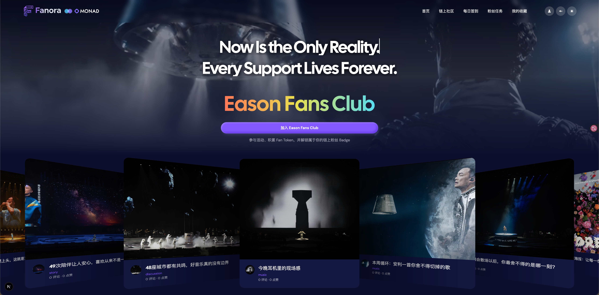
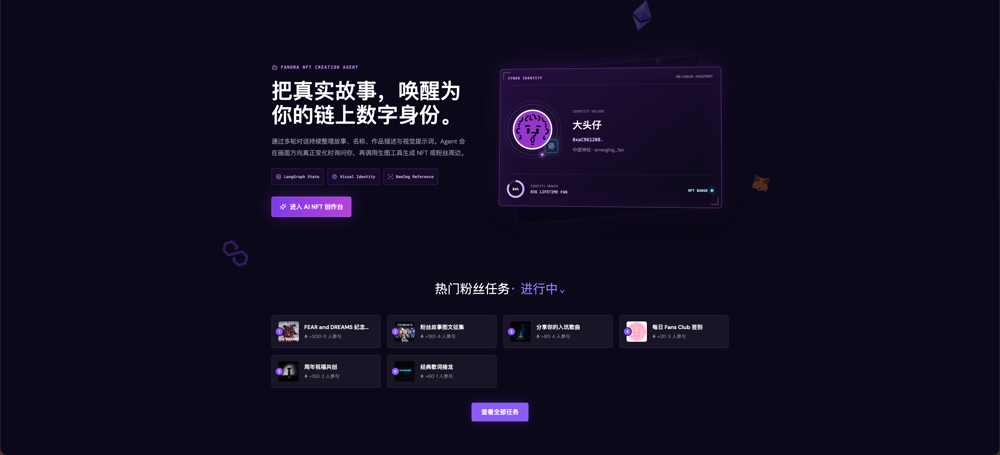
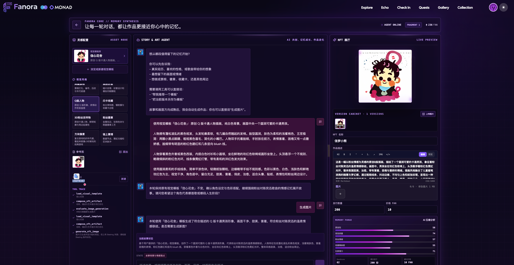
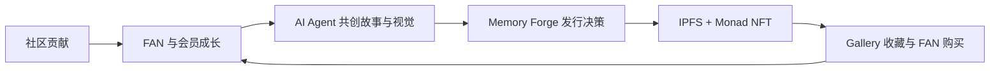

# Fanora

FANORA
Fanora，让热爱成为身份，让故事成为作品。
项目地址：<https://fanora-orpin.vercel.app>

## 项目介绍

Fanora 是一个连接粉丝、故事与数字收藏的 AI 共创平台。

每一次参与、互动与陪伴，都会成为粉丝成长历程的一部分。

AI Agent 将个人经历与情感记忆创作为专属数字纪念作品，让每一份热爱拥有独特身份、永久记录与可验证的价值。

## 项目定位

### Fanora 是一个面向粉丝社区的 AI 共创与数字身份平台。

它不是一个单纯的 AI 生图工具，也不是一个以交易和炒作为核心的 NFT 平台。
Fanora 希望解决一个长期存在的问题：

#### 粉丝投入了时间、情感和陪伴，但这些珍贵的贡献往往无法被持续记录，也无法形成属于自己的身份与记忆。

在今天的粉丝生态中：
粉丝通过签到、互动、内容创作、活动参与和社区贡献表达热爱，但这些成长轨迹通常分散在不同平台，难以沉淀为长期身份；
传统会员体系依赖单个平台，随着平台变化、账号迁移或服务结束，过去积累的荣誉与经历可能逐渐消失；
AI 创作工具能够生成内容，却缺少对粉丝故事、情感经历和社区关系的理解；
数字收藏平台强调作品拥有和交易，但缺少真实的粉丝关系、成长过程和情感连接。
因此，Fanora 希望连接 粉丝成长、社区关系、AI 创作与数字收藏，让每一次参与都有意义，让每一份热爱都有记录。
在 Fanora 中：

### 粉丝的互动与贡献，会逐渐形成独特的社区身份；

AI Agent 会理解个人经历与粉丝故事，将记忆创作为专属数字纪念作品；
每一件作品不仅是一张图片或收藏品，更是粉丝旅程中的一个重要节点。
Fanora 的核心理念：
让热爱被记录，让身份被认可，让记忆拥有归属。
可以概括为：
Web2 的简单体验 + AI 驱动的个性化创作 + Web3 带来的数字所有权与长期验证。

[在线 Demo](https://fanora-orpin.vercel.app/) · [完整项目说明](docs/produce/README.md) · [系统架构](docs/produce/ARCHITECTURE.md) · [AI Agent 设计](docs/produce/AI_AGENT_DESIGN.md)





## 为什么是 Fanora

粉丝在社区里的签到、创作和互动通常无法沉淀为长期资产；传统 NFT 工具又常常只生成一张缺少故事的图片。Fanora 将两条路径连接成一个闭环：



## 3 分钟体验路径

1. 连接钱包并完成签名登录，激活 Monad 正式会员身份。
2. 进入社区签到或完成任务，获得 FAN 与会员成长值。
3. 在 `/collections/create` 与 Agent 多轮对话，选择视觉模板和参考图，生成 NFT 预览。
4. 查看 AI 五维分析与建议发行参数，确认发布并执行 Memory Forge。
5. 发行成功后，作品固定到 IPFS，并由 Monad ERC-1155 铸造；随后可在 Gallery 展示、收藏和购买。

## 核心能力

- **链上粉丝身份**：钱包登录、正式会员、动态会员卡与不可转让 ERC-721 SBT。
- **贡献与成长**：社区、回复、任务、签到、FAN 流水、终身等级和排行榜。
- **AI NFT Studio**：LangGraph 多轮状态、数据库视觉模板、参考图、多模态生图与 Tool 调用。
- **Memory Forge**：五维评分、发行数量与价格建议、可审计的成功或失败判定、Fragment 补偿。
- **NFT 发行与收藏**：BeeImg 业务图片、Pinata IPFS、Monad ERC-1155、Gallery、点赞、收藏与 FAN 购买。

## 技术架构

| 层            | 技术                                                           |
| ------------ | ------------------------------------------------------------ |
| Frontend     | Next.js 15、React 19、TypeScript、RainbowKit、wagmi、viem         |
| Backend      | FastAPI、Python 3.13、SQLModel、Pydantic、Alembic                |
| AI Agent     | LangGraph、LangChain Core、OpenAI-compatible LLM / Image Model |
| Data & Media | PostgreSQL、可选 Redis/Valkey、BeeImg、Pinata IPFS                |
| Blockchain   | Monad Testnet、ERC-721 Membership SBT、ERC-1155 Collectibles   |

## 本地启动

环境要求：Node.js `>= 20.11`、Python `>= 3.13`、`uv`、PostgreSQL。

```bash
# Backend
cd backend
cp .env.example .env
make install
make migrate
make dev
```

```bash
# Frontend
cd frontend
cp .env.example .env.local
npm install
npm run dev
```

访问 `http://localhost:3000`；后端 API 文档位于 `http://localhost:8000/docs`。

## 文档导航

| 文档                                             | 适合谁       | 内容                                     |
| ---------------------------------------------- | --------- | -------------------------------------- |
| [项目总览](docs/produce/README.md)                 | 评委、产品、开发者 | 问题、方案、MVP 路径、核心亮点与完成边界                 |
| [功能树](docs/produce/FUNCTION_TREE.md)           | 评委、测试、产品  | 页面、功能、API 与角色边界                        |
| [系统架构](docs/produce/ARCHITECTURE.md)           | 架构师、开发者   | 分层、数据事实源、关键时序、合约与故障边界                  |
| [AI Agent 设计](docs/produce/AI_AGENT_DESIGN.md) | AI、后端开发者  | LangGraph State、Node、Tool、Prompt 与模型降级 |
| [系统需求](docs/produce/SYSTEM_REQUIREMENTS.md)    | 产品、测试、评审  | MVP 范围、功能需求、非功能需求与验收标准                 |

## 项目结构

```text
Fanora/
├── frontend/          # Next.js Web、钱包与 Web3 交互
├── backend/           # FastAPI、LangGraph、业务服务与数据模型
├── contracts/         # Solidity、Hardhat、Monad 合约
├── shared/contracts/  # 前后端共享 ABI 与部署清单
└── docs/produce/      # 黑客松项目文档
```

Fanora 的核心不是“再做一个 AI 生图页面”，而是让粉丝贡献、身份成长、故事共创、发行策略与链上收藏形成持续循环。
