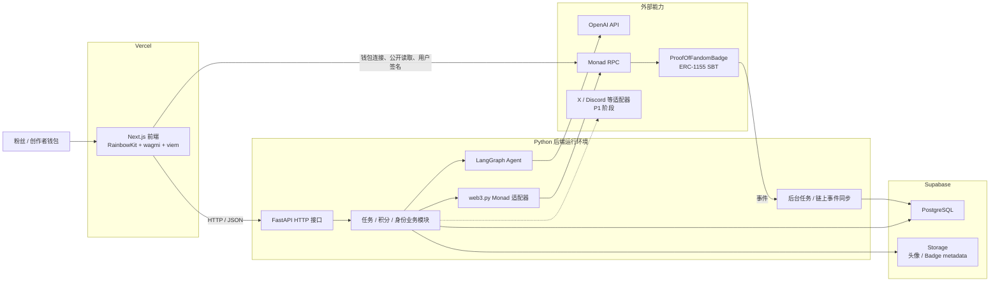
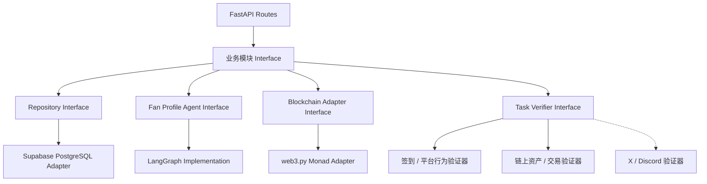
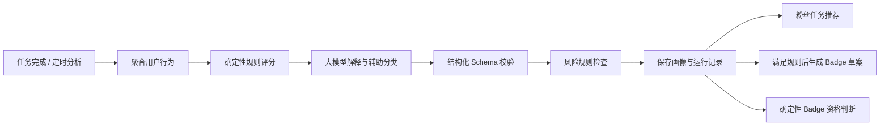
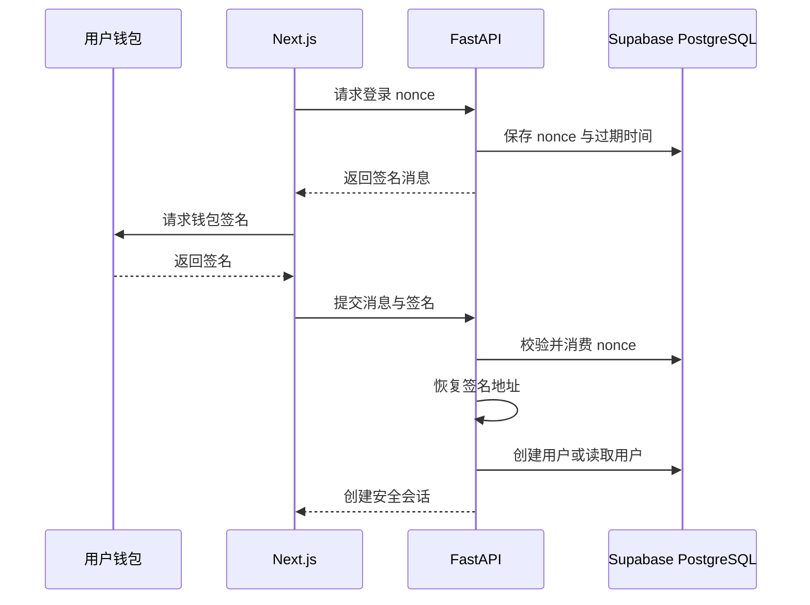
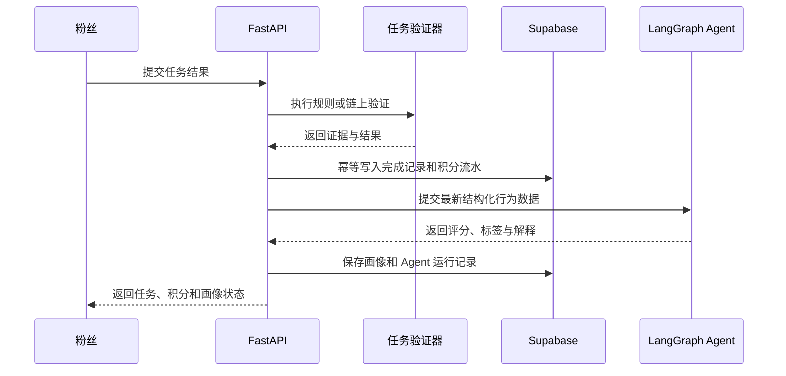
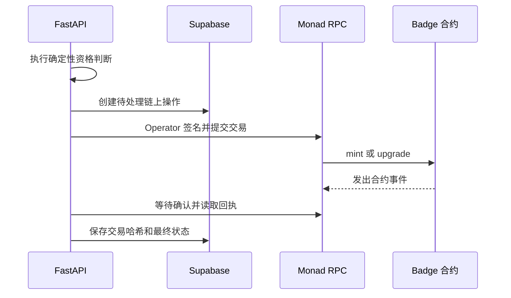
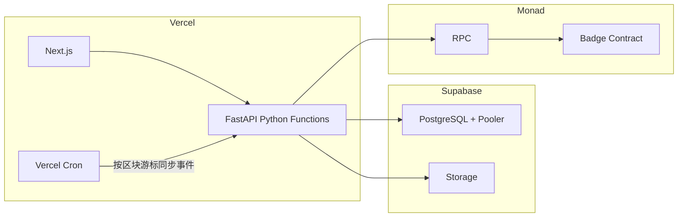
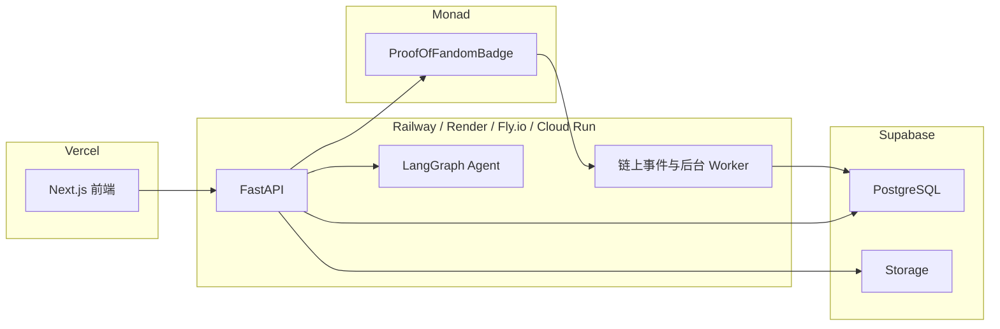

# Fanora Protocol 技术架构文档

> 项目：Fanora Protocol<br>
> 定位：AI Agent 驱动的 Web3 链上粉丝身份与互动平台<br>
> 文档版本：v1.0<br>
> 更新日期：2026-07-16<br>
> MVP 网络：Monad Testnet

## 1. 架构目标

Fanora 将链下互动、Agent 分析与链上身份凭证组合为一个完整业务闭环：

```text
钱包登录 → 参与任务 → 服务端验证 → 积分成长
        → Agent 更新粉丝画像 → Badge 资格判断 → Monad 链上铸造或升级
```

架构需要满足以下目标：

- 前端、Python 后端和 Solidity 合约保持独立依赖与部署生命周期。
- 普通查询体验接近传统 Web 应用，关键身份结果可以链上验证。
- Agent 负责分析、解释和推荐，不直接掌握积分、权限或合约铸造权。
- 私钥、OpenAI API Key 和数据库凭证只存在于服务端安全环境。
- MVP 保持“模块化单体 + 独立合约工程”，暂不拆分复杂微服务。
- 数据库、Agent 和链上写入均支持幂等、审计和失败重试。

## 2. 系统总体架构



## 3. 项目目录与技术栈

```text
Fanora/
├── frontend/       # Next.js 前端
├── backend/        # FastAPI 与 LangGraph 后端
├── contracts/      # Hardhat 与 Solidity 合约
└── docs/           # 需求、架构和开发文档
```

| 层级 | 当前技术 | 主要职责 |
| --- | --- | --- |
| 前端 | Next.js 15、React 19、RainbowKit、wagmi、viem | 页面、钱包连接、签名、公开链上读取、业务操作入口 |
| 后端 | Python、FastAPI、LangGraph、web3.py | 登录验证、任务、积分、Agent、数据库和链上写入编排 |
| 数据 | Supabase PostgreSQL、Supabase Storage | 用户、社区、任务、积分、画像、交易与文件存储 |
| AI | LangGraph、OpenAI Platform API | 粉丝画像、解释、粉丝任务推荐和 Badge metadata 草案 |
| 合约 | Solidity、Hardhat、OpenZeppelin、ERC-1155 | 不可转让 Badge、角色权限、身份升级和链上事件 |
| 区块链 | Monad Testnet / Monad | 身份凭证的可信执行与公开验证 |

## 4. 前端架构

### 4.1 前端职责

- 展示官网、社区、任务中心、用户 Dashboard、徽章墙和创作者控制台。
- 使用 RainbowKit 和 wagmi 管理钱包连接、账户、网络和交易状态。
- 使用 viem 读取 Badge 余额、合约事件和公开链上状态。
- 请求登录 nonce，并让用户通过钱包签署登录消息。
- 调用 FastAPI 完成任务、积分、画像和创作者管理操作。
- 展示链上交易的待签名、待确认、成功和失败状态。

### 4.2 前端不负责的能力

- 不验证任务最终结果。
- 不在浏览器中计算可信积分或等级。
- 不保存 OpenAI API Key、运营私钥或管理员私钥。
- 不直接执行需要 `MINTER_ROLE` 的 Badge 铸造与升级。
- 不把“连接钱包”直接视为“完成服务端登录”。

### 4.3 前端接口位置

- `lib/web3/config.ts`：Monad 网络、RPC 和钱包配置。
- `lib/web3/contracts.ts`：各网络合约地址。
- `lib/web3/abi/`：合约 ABI。
- `hooks/`：钱包和合约读取 Hook。
- 后续新增 `lib/api/`：统一后端请求、认证和错误处理。

## 5. 后端架构

后端采用模块化单体。HTTP、业务规则、Agent、数据库和外部系统通过清晰接口连接，但在 MVP 阶段保持一个代码库和一个主要部署单元。



### 5.1 后端目录职责

| 目录 | 职责 |
| --- | --- |
| `app/api` | HTTP 路由、参数接收、认证入口和响应格式 |
| `app/services` | 任务、积分、等级、身份与 Badge 业务规则 |
| `app/agents` | LangGraph 状态、节点、工作流和结构化输出 |
| `app/repositories` | 数据持久化接口及 Supabase/PostgreSQL 实现 |
| `app/adapters` | Monad、OpenAI、Storage、X、Discord 等外部适配器 |
| `app/models` | 数据库模型 |
| `app/schemas` | 请求、响应和 Agent 输出 Schema |
| `app/core` | 配置、日志、安全和共享基础设施 |

### 5.2 关键接口原则

- 路由只负责 HTTP，不在路由中实现积分或 Badge 资格规则。
- 任务模块通过统一验证器接口调用签到、链上或社交平台验证。
- 业务模块不直接散落调用 web3.py，所有链上操作集中在 Monad 适配器。
- 业务模块只调用“生成粉丝画像”高层接口，不依赖 LangGraph 内部节点。
- 调用方和测试通过同一接口使用模块，方便替换为内存假实现。

## 6. AI Agent 架构

LangGraph 技术上运行在服务端，但它不是后台管理模块。它通过一个小型“生成粉丝画像”接口提供分析能力，不参与角色、任务审批、积分修改、审计处理或链上交易管理。



### 6.1 Agent 输入

- 钱包地址和社区 ID。
- 完成任务数、任务类型和完成时间分布。
- 积分、等级、活跃天数和加入社区时间。
- Monad 链上资产与交易摘要。
- 邀请、传播和社区贡献统计。
- 已知风险信号和数据质量标识。

### 6.2 Agent 输出

- 总身份评分，范围为 0 至 100。
- 活跃度、忠诚度、影响力和贡献度评分。
- 粉丝类型，例如早期支持者、忠诚型、传播型和核心贡献者。
- 风险等级、异常信号和判断依据。
- 面向用户的画像解释。
- 面向粉丝的推荐任务。
- 在确定性积分条件触发后生成的 Badge 名称、描述和 metadata 草案。

### 6.3 Agent 安全限制

- 大模型不能直接写积分流水。
- 大模型不能授予用户或合约角色。
- 大模型不能持有运营私钥。
- 大模型输出必须经过 Schema 和业务规则校验。
- 模型超时或不可用时，系统降级为确定性规则评分。
- Badge 铸造资格由版本化规则最终决定，Agent 结果只能作为输入之一。
- Badge 草案必须由创作者确认，Agent 不能自动发布、铸造或升级。

### 6.4 明确排除的后台职责

LangGraph 不用于以下后台管理能力：

- 用户、创作者和管理员角色管理。
- 任务创建、发布、暂停和人工审批。
- 积分纠错、等级阈值配置和奖励发放。
- 合约角色管理、交易重试和链上对账。
- 审计日志处理、数据导出和系统配置。
- 创作者运营报告、聊天式运营助手和复杂风控工作台。

这些能力由确定性业务模块和简单受保护界面完成。创作者控制台只保留任务管理、基础统计、粉丝列表和 Badge 草案确认。

## 7. 数据架构

### 7.1 数据归属

| 数据类型 | 保存位置 | 原因 |
| --- | --- | --- |
| Badge 类型、持有状态、升级事件 | Monad 合约 | 公开验证、不可篡改和可组合 |
| 关键凭证摘要 | Monad 或 Badge metadata | 证明身份结论，不暴露完整隐私数据 |
| 用户资料、社区、任务和任务进度 | Supabase PostgreSQL | 需要频繁查询和更新 |
| 积分流水和等级 | Supabase PostgreSQL | 成本低、支持审计和复杂查询 |
| Agent 输入摘要、输出与版本 | Supabase PostgreSQL | 支持追踪、评测和重新计算 |
| 头像、Badge 图片和 metadata | Supabase Storage，后续可迁移 IPFS | MVP 部署简单，便于管理 |
| 完整社交平台原始数据 | 原则上不长期保存 | 降低隐私和合规风险 |

### 7.2 MVP 核心数据表

- `users`：钱包用户资料和状态。
- `wallet_nonces`：一次性登录 nonce。
- `sessions`：服务端登录会话。
- `communities`：创作者社区。
- `community_members`：用户和社区关系。
- `tasks`：任务、奖励快照和验证规则。
- `task_claims`：领取、提交、验证和奖励状态。
- `point_ledger`：不可直接修改的积分流水。
- `fan_profiles`：当前粉丝画像。
- `fan_profile_runs`：Agent 运行记录与版本。
- `badge_transactions`：Badge 铸造、升级与链上确认状态。
- `audit_logs`：敏感操作审计记录。

## 8. 智能合约架构

MVP 使用 `ProofOfFandomBadge` ERC-1155 合约表达多等级粉丝身份。

### 8.1 合约职责

- 使用不同 Badge ID 表达 Bronze、Silver、Gold 和 Core 等级。
- 禁止普通用户之间转让，使 Badge 具备 SBT 属性。
- 只允许 `MINTER_ROLE` 铸造和升级 Badge。
- 只允许 `URI_MANAGER_ROLE` 更新 metadata 基础 URI。
- 通过事件向前端和后端公开铸造、升级与配置变化。

### 8.2 合约不保存的数据

- 完整粉丝画像。
- 社交平台原始互动记录。
- 每次浏览、签到等高频行为。
- OpenAI 输出原文。
- 频繁变化的完整积分流水。

### 8.3 链上写入原则

前端可以通过用户钱包执行公开读取和普通签名，但 Badge 铸造与升级采用后端受控流程：

```text
任务验证通过
  → 写入积分流水
  → 更新等级和画像
  → 判断 Badge 资格
  → 创建链上写入记录
  → Operator 签名交易
  → 等待 Monad 确认
  → 保存交易哈希和最终状态
```

同一业务操作必须具有唯一幂等键，防止请求重试导致重复铸造。

## 9. 核心业务数据流

### 9.1 钱包签名登录



连接钱包只证明前端知道当前地址，只有服务端验证签名后才视为完成登录。

### 9.2 任务、积分与 Agent



### 9.3 Badge 铸造与升级



## 10. Vercel 与 Supabase 部署评估

### 10.1 能力适配表

| 模块 | 建议位置 | 适配程度 | 说明 |
| --- | --- | --- | --- |
| Next.js 前端 | Vercel | 非常适合 | 原生支持构建、预览和环境变量 |
| PostgreSQL | Supabase | 非常适合 | 适合任务、积分、画像和审计数据 |
| 图片与 metadata | Supabase Storage | 适合 | MVP 简单，后续可迁移 IPFS |
| FastAPI 短请求 | Vercel Python Functions | 可以 | 适合登录、查询和短事务请求 |
| 短 LangGraph 工作流 | Vercel Functions | 有条件适合 | 必须控制运行时间并支持超时降级 |
| 长时间 Agent 任务 | Vercel Functions | 不推荐 | 容易受函数执行时间和生命周期限制 |
| 持续监听 Monad 事件 | Vercel Functions | 不适合 | 无法依赖常驻进程持续监听 |
| Python 后台 Worker | Supabase Edge Functions | 不适合 | Edge Functions 不是 FastAPI/Python 运行环境 |
| Solidity 合约 | Monad | 必须链上部署 | 不运行在 Vercel 或 Supabase |

### 10.2 方案 A：纯 Vercel + Supabase MVP



该方案适合简历项目、答辩和早期测试，但需要遵守以下限制：

- Agent 必须在函数允许的时间内完成，超时后返回规则降级结果。
- HTTP 响应完成后不能依赖进程继续执行后台任务。
- 合约事件采用定时按区块扫描，不使用常驻 WebSocket 监听。
- FastAPI 连接 Supabase 时使用连接池或 Supabase Pooler，避免函数实例创建过多连接。
- 链上写入、Agent 分析和事件同步必须可重试且幂等。
- 前端与 FastAPI 可以作为同一 monorepo 下的不同 Vercel Project 部署。

### 10.3 方案 B：推荐部署架构



这是 Fanora 完成功能后的推荐形态：

- Vercel 只承载擅长的 Next.js 前端。
- Supabase 负责 PostgreSQL 和文件存储。
- 常驻 Python 平台负责 FastAPI、LangGraph 和 Worker。
- Monad 独立承载 Solidity 合约。
- API、Agent 和 Worker 可以先在同一 Python 服务中运行，业务增长后再拆分。

## 11. 环境变量规划

### 11.1 前端 Vercel 环境变量

```text
NEXT_PUBLIC_APP_NAME
NEXT_PUBLIC_APP_URL
NEXT_PUBLIC_API_URL
NEXT_PUBLIC_WALLETCONNECT_PROJECT_ID
NEXT_PUBLIC_MONAD_TESTNET_RPC_URL
NEXT_PUBLIC_BADGE_CONTRACT_ADDRESS_MONAD_TESTNET
```

所有 `NEXT_PUBLIC_` 变量都会发送到浏览器，只能存放公开配置。

### 11.2 FastAPI 服务端环境变量

```text
DATABASE_URL
FRONTEND_ORIGIN
MONAD_RPC_URL
MONAD_CHAIN_ID
BADGE_CONTRACT_ADDRESS
OPERATOR_PRIVATE_KEY
OPENAI_API_KEY
OPENAI_MODEL
SUPABASE_URL
SUPABASE_SERVICE_ROLE_KEY
```

`OPERATOR_PRIVATE_KEY`、`OPENAI_API_KEY` 和 `SUPABASE_SERVICE_ROLE_KEY` 只能配置在服务端。

### 11.3 Hardhat 部署环境变量

```text
MONAD_RPC_URL
MONAD_CHAIN_ID
DEPLOYER_PRIVATE_KEY
BADGE_BASE_URI
```

部署账户应使用独立测试钱包，不能使用存有真实资产的主钱包。

## 12. 安全架构

- 钱包登录使用一次性 nonce、域名、链 ID、签发时间和过期时间防止重放。
- FastAPI 对角色、社区归属和资源权限进行服务端校验。
- 积分使用追加式流水，修正积分时增加调整记录，不删除历史记录。
- Badge 合约将管理员、铸造者和 URI 管理者权限分离。
- Agent 输出不能绕过确定性业务规则。
- 密钥和令牌不进入前端、不写入日志、不提交 GitHub。
- 链上交易保存业务幂等键、交易哈希、确认状态和失败原因。
- 外部社交平台数据仅按授权采集，减少原始敏感数据保存。

## 13. 可扩展性策略

MVP 阶段优先保持简单，仅在真实需求出现时增加接口或拆分部署：

- 数据量增长：为任务、积分和画像查询添加索引和分页。
- Agent 变慢：将分析请求转为队列任务，前端轮询或订阅状态。
- 链上请求增长：增加 RPC 提供商、缓存公开读取并批量处理事件。
- Worker 负载增长：将 API 与后台 Worker 分为两个部署进程。
- 社交平台增加：为每个平台实现独立任务验证适配器。
- 多链需求出现：在区块链适配器后增加链配置，而不是把链判断散落到业务代码。
- Agent 功能扩展：仍优先保持单一粉丝画像工作流，不建设多 Agent 管理平台。

## 14. 当前实现状态与部署缺口

### 14.1 当前已具备

- Next.js 前端模板和生产构建能力。
- RainbowKit、wagmi、viem 与 Monad 网络基础配置。
- FastAPI 应用入口和健康检查。
- LangGraph 规则评分与分类示例。
- ERC-1155 SBT 合约、权限、铸造、升级和基础测试。
- 前端、后端和合约独立环境变量示例。

### 14.2 部署前仍需完成

- 接入 Supabase PostgreSQL。
- 增加 SQLAlchemy、数据库迁移和仓储实现。
- 完成钱包 nonce、签名验证和安全会话。
- 完成任务、积分与等级业务模块。
- 接入 OpenAI Platform API 并实现 Agent 降级。
- 部署 Badge 合约至 Monad Testnet。
- 将合约 ABI、地址和 Badge ID 同步到前后端。
- 实现链上交易状态追踪和事件同步。
- 增加 FastAPI 部署配置与生产日志。
- 配置 Vercel、Supabase 和 Python 服务端环境变量。

## 15. 架构结论

Fanora 可以使用 Vercel 和 Supabase 完成 MVP：Vercel 部署 Next.js 和短生命周期 FastAPI 请求，Supabase 提供 PostgreSQL 与 Storage，Monad 承载 Solidity 合约。

当 Agent 工作流、异步任务和链上事件监听变复杂后，推荐将 FastAPI、LangGraph 与 Worker 部署到 Railway、Render、Fly.io 或 Cloud Run 等支持常驻 Python 进程的平台。最终推荐组合为：

```text
Vercel Next.js
    + Supabase PostgreSQL / Storage
    + 常驻 FastAPI / LangGraph / Worker
    + Monad Solidity 合约
    + OpenAI Platform API
```
