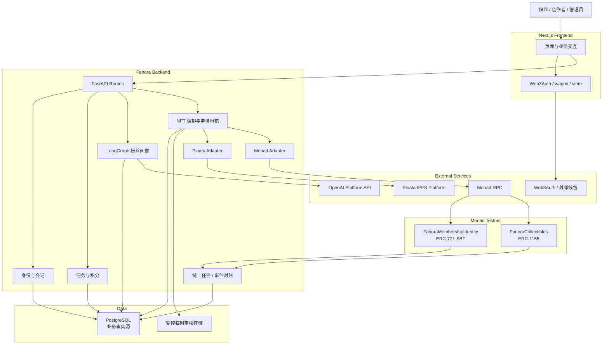
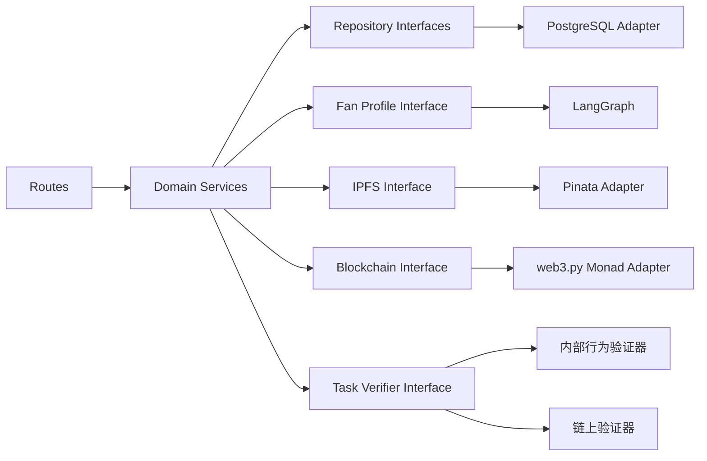
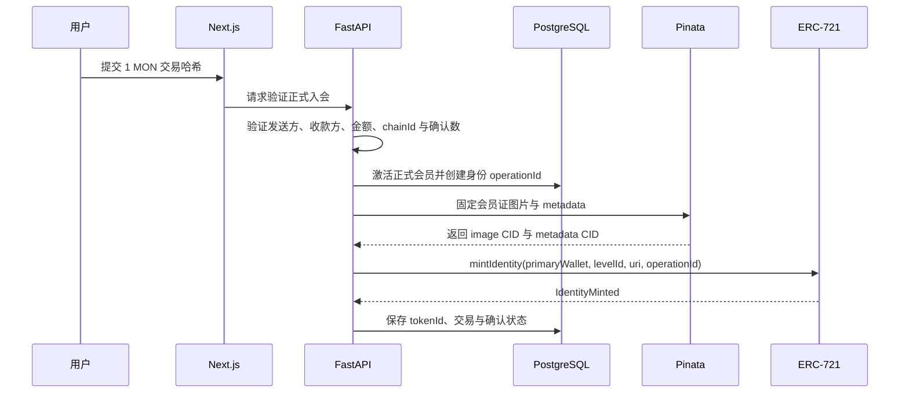
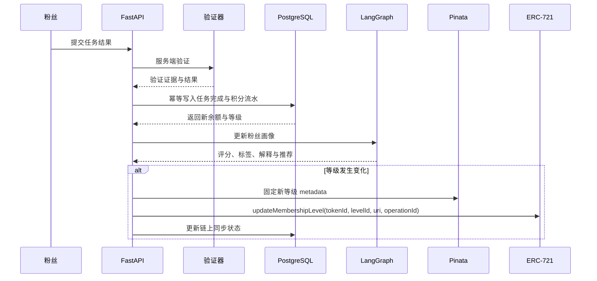
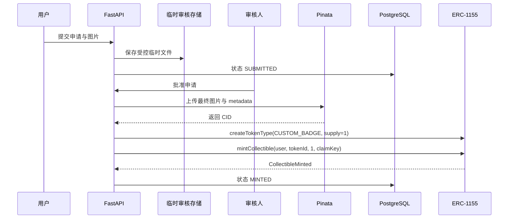

# Fanora Protocol 技术架构文档

> 文档版本：v1.3\
> 更新日期：2026-07-20\
> 需求基线：[PRODUCT_REQUIREMENTS.md](./PRODUCT_REQUIREMENTS.md)\
> MVP 网络：Monad Testnet

## 1. 架构结论

Fanora 采用“链下业务事实 + 链上公开凭证”的混合架构：

```text
登录与主钱包
  → 任务验证
  → PostgreSQL 积分与等级
  → LangGraph 粉丝画像
  → Pinata IPFS metadata
  → Monad ERC-721 会员身份 / ERC-1155 纪念资产
```

核心边界如下：

- PostgreSQL 是用户、任务、积分、等级、审核和链上任务状态的业务事实源。
- ERC-721 保存唯一、不可转让的会员身份和当前公开等级，tokenId 在升级时保持不变。
- ERC-1155 保存演唱会纪念卡、自定义纪念徽章和任务限定 Badge。
- Pinata 保存已批准 NFT 图片与 metadata；合约保存 `ipfs://CID`。
- LangGraph 负责分析、解释、推荐和 ERC-1155 草案，不修改积分、不审批申请、不决定 ERC-721 等级。
- 链上写入采用后台异步任务、唯一 operationId/claimKey、确认状态和事件对账。
- 当前 `ProofOfFandomBadge.sol` 仅为早期 ERC-1155 SBT 原型，目标架构需要两个新合约。

## 2. 系统总体架构



## 3. 项目模块与职责

| 模块 | 当前技术 | 主要职责 |
| --- | --- | --- |
| `frontend` | Next.js 15、React 19、Web3Auth、RainbowKit、wagmi、viem | 登录、资料、官方社区、任务、会员证、收藏页和申请交互 |
| `backend` | FastAPI、SQLModel、Alembic、LangGraph、web3.py | 认证、任务、积分、等级、Agent、Pinata、NFT 编排和事件对账 |
| `contracts` | Solidity、Hardhat、OpenZeppelin | ERC-721 会员身份与 ERC-1155 纪念资产 |
| `docs` | Markdown | 产品需求、架构、路线图、开发说明和历史证据 |

模块之间保持独立依赖和部署生命周期。前端不导入后端或 Hardhat 依赖，后端不直接依赖前端状态，合约不理解数据库或 Pinata API。

## 4. 领域边界

### 4.1 身份与钱包

- 快捷登录用户通过 Web3Auth 创建或恢复嵌入式钱包。
- 外部钱包用户通过一次性 challenge 和钱包签名完成服务端认证。
- 业务模块只读取统一 `user_id` 与 `primary_wallet`，不判断具体登录提供商。
- Fanora 后端不生成、保存或记录用户钱包私钥。
- 主钱包切换属于高风险操作；不可转让身份 NFT 不自动迁移。

### 4.2 单一官方社区

- Fanora MVP 只启用一个固定的官方社区记录。
- 前端直接展示官方社区，不提供社区列表、搜索、分页、创建、删除或切换入口。
- `communities` 与 `community_members` 表继续使用，但只保存官方社区资料和用户加入关系。
- 任务、Fan Token、等级、会员身份和纪念资产使用平台全局配置，不按社区建立独立账户或命名空间。
- 创作者只维护官方社区资料和全局内容，不设计多社区所有权或多管理员权限系统。

### 4.3 正式会员、积分与等级

- 新用户默认为待入会。
- 后端验证 1 MON 交易的发送方、收款方、金额、chainId、交易状态和确认数后激活正式会员。
- Fan Token 是精度 0 的站内积分，不是 ERC-20。
- 积分通过追加式流水产生，等级由 PostgreSQL 中的版本化阈值规则计算。
- 积分变化可以异步触发 ERC-721 身份升级，但链上失败不回滚合法积分。

### 4.4 任务与奖励

- 任务领取、提交、验证、积分和 NFT 奖励分别记录状态。
- 服务端验证是奖励依据，前端提交结果不能直接视为完成。
- 同一用户、任务和奖励版本使用唯一业务幂等键。
- 任务可以同时奖励 Fan Token 和一个 ERC-1155 限定 Badge。

### 4.5 NFT 与 metadata

- ERC-721 会员身份：每个有效主钱包最多一个 token；升级更新同一 token 的 levelId 与 metadata。
- ERC-1155 纪念资产：类别为演唱会纪念卡、自定义纪念徽章或任务限定 Badge。
- 未审核用户图片存入受控临时存储；审核通过后才上传 Pinata。
- 图片 CID 先生成，metadata JSON 引用 `ipfs://imageCid` 后再上传得到 metadata CID。
- 合约只保存 URI、等级/类别和必要约束，不保存图片二进制、完整积分或私密数据。

### 4.6 AI Agent

LangGraph 的高层接口是“生成粉丝画像与推荐”，输入和输出必须结构化。

允许：

- 聚合任务、积分、活跃天数和公开链上摘要。
- 生成评分、粉丝类型、解释和推荐任务。
- 为已批准的 ERC-1155 纪念主题生成 metadata 草案。

禁止：

- 修改积分、等级、角色或任务状态。
- 审批自定义 NFT 申请。
- 决定 ERC-721 会员等级。
- 持有 Pinata JWT、运营私钥或管理员私钥。
- 直接提交链上交易或处理交易重试。

## 5. 前端架构

### 5.1 当前职责

- 官网、登录、Profile、官方社区展示与加入、正式入会页面。
- 统一 Axios API 客户端与用户会话状态。
- Web3Auth 嵌入式钱包和外部钱包交互入口。
- 公开 Monad 读取、交易状态和区块浏览器链接。
- 私钥导出只在用户明确确认后通过浏览器 Provider 执行，不经过后端。

### 5.2 目标页面

- Dashboard：积分、等级、画像和链上同步状态。
- 会员证：ERC-721 tokenId、当前等级、metadata 与交易记录。
- 收藏页：演唱会纪念卡、自定义纪念徽章和任务限定 Badge。
- NFT 申请页：图片预览、版权确认、审核状态和失败原因。
- 创作者控制台：任务、统计、纪念资产草稿和申请审核。

### 5.3 前端不负责

- 不计算可信积分或等级。
- 不验证任务最终结果。
- 不保存 OpenAI Key、Pinata JWT、运营私钥或数据库凭证。
- 不允许用户指定可信 tokenId、levelId、合约地址、metadata URI 或任意铸造地址。
- 不直接调用带有合约运营角色的写方法。

## 6. 后端架构

后端继续采用模块化单体。HTTP、业务规则、数据库、Agent、IPFS 和链上适配器通过小接口连接，MVP 不拆分微服务。



建议领域服务：

- `IdentityService`：统一用户、登录身份、钱包和会话。
- `MembershipService`：1 MON 正式入会与会员状态。
- `TaskService`：任务状态、领取、提交和验证。
- `PointService`：积分流水、余额和等级计算。
- `FanProfileService`：LangGraph 高层接口与运行记录。
- `NftApplicationService`：自定义 NFT 申请、审核和状态转换。
- `MetadataService`：图片、JSON、CID 和版本。
- `NftOrchestrator`：资格判断后创建链上 operationId/claimKey。
- `BlockchainAdapter`：交易构建、提交、回执和事件解析。
- `ReconciliationWorker`：确认数、链重组和数据库/链上对账。

## 7. 数据架构

### 7.1 数据归属

| 数据 | 事实源 | 说明 |
| --- | --- | --- |
| 用户、钱包、会话、官方社区 | PostgreSQL | 强一致业务关系和权限；社区固定为单一记录 |
| 任务、领取、验证、积分流水 | PostgreSQL | 高频写入、幂等和审计 |
| 当前积分与等级 | PostgreSQL | 不写入链上完整流水 |
| Agent 输入摘要、输出、版本 | PostgreSQL | 可追踪与重新计算 |
| 未审核用户图片 | 受控临时存储 | 不直接公开固定到 IPFS |
| 已批准图片与 metadata | Pinata IPFS | CID 内容寻址和公开读取 |
| ERC-721 身份状态 | Monad | 公开验证唯一身份与当前等级 |
| ERC-1155 类型、余额与事件 | Monad | 公开验证纪念资产和发行约束 |
| 交易提交、确认和对账状态 | PostgreSQL | 支持失败重试与恢复 |

### 7.2 当前已存在的核心表

- `users`、`user_profiles`
- `auth_identities`、`wallets`
- `login_challenges`、`user_sessions`
- `communities`、`community_members`（MVP 仅一条官方社区及其成员关系）
- `membership_levels`、`fan_token_rules`、`fan_token_config`
- `official_membership_payments`
- `fan_profile_runs`

### 7.3 目标新增表

- `tasks`、`task_claims`、`point_ledger`（全局数据，不增加社区分区）
- `fan_profiles`
- `membership_identity_nfts`
- `nft_token_types`、`nft_claims`
- `nft_applications`、`nft_metadata_versions`
- `ipfs_pins`、受控申请文件记录
- `nft_transactions`、状态历史与 `audit_logs`

### 7.4 一致性原则

- 数据库事务先记录合法业务结果，再异步创建链上操作。
- 每个身份铸造/升级使用唯一 operationId，每次 ERC-1155 领取使用唯一 claimKey。
- 数据库唯一约束与合约防重同时存在，不能只依赖其中一侧。
- 链上确认失败不删除任务完成或积分流水，只更新 NFT 同步状态。
- Worker 通过合约事件和交易回执修复漏记或状态不一致。

## 8. 智能合约架构

### 8.1 FanoraMembershipIdentity

目标标准：ERC-721 + metadata + AccessControl + Pausable，会员身份为 SBT。

职责：

- 每个主钱包最多一个有效身份 token。
- 记录 tokenId、当前 levelId、metadata URI 和必要版本。
- 通过 `mintIdentity` 创建身份，通过 `updateMembershipLevel` 更新同一 token。
- 阻止普通转让和授权绕过。
- 使用 operationId 防止重复铸造或升级。
- 发出身份铸造、等级变化、metadata 更新和撤销事件。

不保存：

- 实时 Fan Token 余额和完整积分流水。
- 任务明细、邮箱、社交原始数据或 Agent 原始输出。

### 8.2 FanoraCollectibles

目标标准：ERC-1155 + AccessControl + Pausable。

每个 tokenId 配置：

- `category`
- `metadataUri`
- `maxSupply` 与累计 `mintedSupply`
- `perWalletLimit`
- `mintStart`、`mintEnd`
- `transferable`
- `metadataFrozen`、`active`

合约必须在链上校验供应量、累计钱包领取量、时间窗和 claimKey。自定义徽章默认供应量 1 且不可转让；任务限定 Badge 单钱包最多 1；演唱会纪念卡的转让策略在创建时确定。

### 8.3 当前原型迁移

当前 `ProofOfFandomBadge`：

- 已实现 ERC-1155、角色、基础 mint/upgrade、URI 和全局 Soulbound。
- 未实现 ERC-721 唯一会员身份。
- 未实现三类 ERC-1155 token 类型、供应量、钱包限额、时间窗、claimKey 和 metadata 冻结。

因此它只作为 OpenZeppelin、Hardhat 和 Monad 配置参考，不直接认定为目标合约完成。

## 9. 核心业务流

### 9.1 正式入会与 ERC-721 身份



### 9.2 任务、积分与身份升级



### 9.3 用户自定义纪念徽章



### 9.4 演唱会纪念卡与任务限定 Badge

- 创作者先创建资产草稿、发行约束和领取依据。
- 后端审核 metadata 并固定到 Pinata，再创建 ERC-1155 token 类型。
- 演唱会纪念卡通过已验证打卡任务或经审计领取名单发放。
- 任务限定 Badge 只在任务完成且领取时间窗有效时创建 claimKey。
- 前端不能提交任意铸造地址；后端始终使用当前用户经过验证的主钱包。

## 10. 部署架构

推荐 MVP 组合：

```text
Vercel
  └─ Next.js Frontend

Railway / Render / Fly.io / Cloud Run
  ├─ FastAPI
  ├─ LangGraph
  └─ Worker / Reconciliation

PostgreSQL / Supabase
  ├─ 业务数据库
  └─ 受控临时审核存储

Pinata
  └─ 已批准 NFT 图片与 metadata

Monad Testnet
  ├─ FanoraMembershipIdentity
  └─ FanoraCollectibles
```

Vercel Functions 可以用于短请求，但不适合依赖 HTTP 返回后继续执行的链上写入或常驻事件监听。链上交易、Pinata 重试和事件对账应在支持常驻进程或可靠任务队列的 Python 环境运行。

## 11. 配置边界

### 11.1 当前已有公开前端配置

- `NEXT_PUBLIC_API_URL`
- `NEXT_PUBLIC_WEB3AUTH_CLIENT_ID`
- `NEXT_PUBLIC_WEB3AUTH_NETWORK`
- `NEXT_PUBLIC_WALLETCONNECT_PROJECT_ID`
- `NEXT_PUBLIC_MONAD_TESTNET_RPC_URL`

目标双合约接入后，以公开变量提供 ERC-721 和 ERC-1155 地址。公开变量只能包含可公开链上配置，不能包含任何密钥。

### 11.2 当前已有服务端配置

- `DATABASE_URL`
- Web3Auth 验证配置
- `MONAD_RPC_URL`、`MONAD_CHAIN_ID`
- 正式入会收款地址、费用和确认数
- `OPENAI_API_KEY`、模型与超时配置
- 当前原型 `BADGE_CONTRACT_ADDRESS`、`OPERATOR_PRIVATE_KEY`

### 11.3 v1.3 目标新增配置

命名以实现时最终配置模型为准，至少需要表达：

- ERC-721 会员身份合约地址。
- ERC-1155 纪念资产合约地址。
- 各最小权限运营签名账户或安全签名服务。
- Pinata JWT、Gateway Base URL 与可选 Gateway Token。
- 临时审核存储桶和文件限制。
- 链上确认数、任务轮询间隔和事件起始区块。

Pinata JWT、运营私钥、管理员私钥、数据库凭证和 OpenAI Key 只能存在服务端密钥环境。

## 12. 安全与可靠性

- 登录 challenge 一次性、限时并绑定域名、钱包地址和 chainId。
- Web3Auth Identity Token 在后端验证签名、issuer、audience、过期时间和用户标识。
- 积分、任务、审核和链上参数全部由服务端确定。
- 用户上传图片验证 MIME、文件签名、大小、尺寸和内容；MVP 不接受未经清洗的 SVG。
- 未审核文件不进入公开 IPFS。
- Pinata JWT 与链上运营签名权限分离。
- 合约按角色拆分管理员、铸造者、等级管理、类型管理、URI 管理和暂停权限。
- operationId/claimKey 在数据库与合约两侧防重。
- 链上任务保存提交、确认、失败、可重试和需要对账状态。
- metadata 更新产生新 CID；旧 CID 和版本保留。
- 已冻结 ERC-1155 metadata 不可再次更新，已铸造内容默认不自动 unpin。

## 13. 当前实现状态

### 13.1 已具备

- Web3Auth 快捷登录、钱包签名挑战、统一会话、用户资料和私钥导出安全交互。
- 用户、钱包、官方社区成员、会员等级、Fan Token 规则和正式入会数据模型。
- 1 MON 正式入会交易验证与前端页面。
- 首页会员等级真实数据、当前等级、升级差额和 Coverflow 展示。
- FastAPI、LangGraph、PostgreSQL/Alembic、本地 Docker 数据库、日志和健康检查基础。
- ERC-1155 SBT 原型合约、基础铸造和禁止转让测试。

### 13.2 仍需完成

- 外部钱包完整端到端登录与主钱包管理。
- 任务、任务验证、积分流水和等级事件闭环。
- ERC-721 `FanoraMembershipIdentity`。
- ERC-1155 `FanoraCollectibles` 的类别、供应、限额、时间窗和 claimKey。
- Pinata 适配器、metadata 版本和临时审核存储。
- 自定义 NFT 申请与创作者审核。
- 链上异步写入、确认、重试、事件监听和对账。
- 会员证、收藏页、任务限定 Badge 和申请页面。
- Monad Testnet 双合约部署与 ABI/地址同步。

## 14. 非目标

MVP 暂不实现：

- 多社区创建、搜索、切换和独立配置。
- 按社区拆分积分、任务、等级、Badge 或管理员权限。
- 多链和跨链身份聚合。
- 将完整积分、任务或粉丝画像写入链上。
- NFT 二级市场、拍卖、版税和跨平台交易聚合。
- DAO、协议代币或真实空投。
- 多 Agent 管理平台和 AI 自动审批。
- 未经安全评估的 Monad 主网部署。
