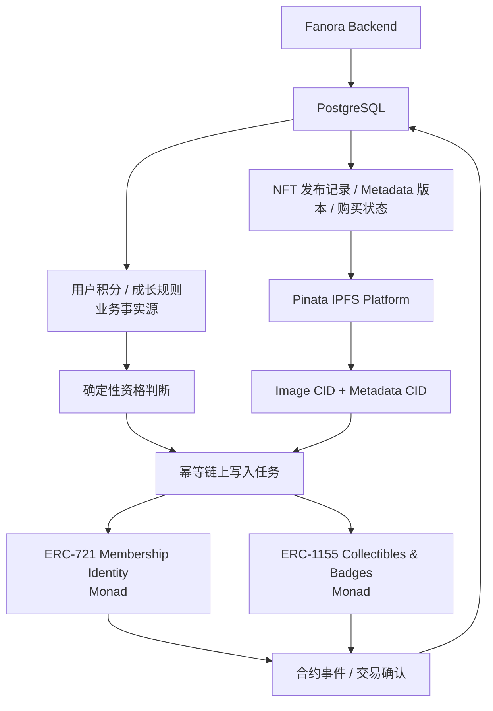

# Fanora Protocol 产品与开发需求文档

> 项目名称：Fanora Protocol（凡诺拉协议 / 粉环协议）\
> 项目定位：AI Agent 驱动的 Web3 链上粉丝身份与互动平台\
> 文档版本：v1.6\
> 文档日期：2026-07-23\
> 需求状态：社区、Fan Token、AI 画像、三合约与 NFT 核心链路已完成并部署 Monad Testnet；事件对账、任务 Badge 和生产治理持续开发\
> 核心网络：Monad Testnet（MVP）\
> 文档入口：[README.md](./README.md)

## 1. 文档使用方法

- `[ ]` 表示尚未完成。
- `[x]` 表示已经完成并通过当前阶段验证。
- 每条需求都包含唯一编号，提交代码、测试记录和答辩材料应引用对应编号。
- `MVP` 表示首个可演示版本必须完成，`P1` 表示增强版本，`P2` 表示远期能力。
- 需求只有在功能实现、验收标准满足、相关测试通过后才能核销。

### 1.0 2026-07-23 完成记录

- 已删除前后端 Web3Auth 登录、Identity Token 校验、嵌入式钱包和私钥导出逻辑，登录统一使用 RainbowKit 直连钱包。
- 已完成连接钱包、一次性 challenge、钱包签名、`POST /auth/wallet` 会话创建和 Gateway 入会付款，平台不接触用户私钥。
- 已完成社区创作、多图 Markdown、评论回复、图片预览、分页加载、任务动画和首页动态内容。
- 已完成 Fan Token 发布/回复/点赞/收藏规则、签到月历与积分等级联动。
- 已完成 Gateway、ERC-721 会员身份和 ERC-1155 纪念资产合约及 19 项 Hardhat 测试。
- 已完成可用 FAN 与终身累计 FAN 分离，消费不降低已经获得的会员等级。
- 已完成会员证生成/刷新、粉丝限量 NFT 发布、点赞/收藏、创作者集合、FAN 购买、ERC-1155 铸造和收藏品头像设置。
- 三个合约已部署 Monad Testnet，并通过脚本同步 ABI、地址、角色、区块和前后端环境变量。
- 完整证据与剩余工作见 [DELIVERY_SUMMARY_2026-07-23.md](./DELIVERY_SUMMARY_2026-07-23.md)。

### 1.1 2026-07-20 完成记录

- 该阶段曾实现第三方快捷登录；2026-07-22 已由 RainbowKit 直连钱包签名登录替代。
- 已完成用户、登录身份、主钱包、用户资料、角色、登录挑战、会话、社区和社区成员的数据模型，并将 PostgreSQL 迁移同步至 `20260720_0002`。
- 已完成 `/login` 与 `/profile` 前端页面、Axios 统一请求、个人资料维护、公开范围控制、公开社区浏览和加入社区交互。
- 该阶段曾实现嵌入式钱包私钥导出；2026-07-22 已随第三方快捷登录一并删除，钱包备份只在用户钱包应用中操作。
- 已完成首页会员等级与 Badge 成长真实数据链路：`membership_levels` 保存 Badge 图片地址，`GET /api/v1/membership-levels` 返回启用等级，前端通过 Axios 展示数据库门槛、图片、当前等级和下一等级差额，不再使用 Badge mock 数据；展示层参考模板 `CharecterSlider`，使用动态彩色描边、Coverflow、加载渐入和自动循环轮播。
- 已将模板 `Intro` 的漂浮 Web3 图标用于热门粉丝任务模块，并将 `Statictis` 的紫色渐变素材用于会员等级与 Badge 成长背景。
- 已新增链上会费正式入会门槛（默认 1 MON，可由资金管理员调整）：注册用户默认为“待入会”，后端验证 Monad Testnet 付款的发送主钱包、Gateway 合约、事件金额、链 ID、交易状态和确认数后才激活正式会员；未入会用户在首页看到缴费按钮，签到和任务入口统一跳转缴纳页。
- 已通过后端认证测试、前端 ESLint、TypeScript 检查、生产构建以及本地前后端健康检查。未执行自动化真实私钥导出测试，避免在测试输出或日志中暴露密钥。
- 尚未核销的身份相关工作主要包括：WalletConnect 完整联调、显式切链体验、钱包关联/主钱包切换、创作者管理前端和更完整的认证边界测试。

### 1.2 2026-07-20 链上资产架构决策

- Fanora 核心会员身份使用不可转让的 ERC-721。每名正式会员的主钱包最多持有一个身份 NFT；积分达到等级阈值时更新同一个 token 的等级与 metadata，不通过反复销毁、重铸表达升级。
- 演唱会纪念卡、用户申请的自定义 NFT 纪念徽章和完成任务后获得的限定 Badge 使用 ERC-1155。一个合约可以管理多个资产类型、发行上限和单钱包领取上限。
- Fan Token 积分、等级阈值、任务状态和审核状态以 PostgreSQL 为业务事实源，不把频繁变化的积分余额写入链上。
- NFT 图片和 metadata 由 Fanora Backend 上传至 Pinata IPFS Platform；合约保存 `ipfs://CID`，Pinata JWT、API Secret 和运营签名私钥不得进入前端。
- 早期 `ProofOfFandomBadge` ERC-1155 SBT 原型已删除；正式实现使用会员付款 Gateway、ERC-721 身份和 ERC-1155 纪念资产三个职责独立的合约。

### 1.3 2026-07-20 单一官方社区范围决策

- MVP 只运营一个固定的 Fanora 官方社区，不提供创建、删除、搜索、分页或切换多个社区的产品能力。
- 每个用户只维护一个全局 Fan Token 余额和一套全局等级；任务、ERC-721 会员身份和 ERC-1155 Badge 不按社区拆分。
- 创作者只维护官方社区资料、全局任务和纪念资产草稿，不建设多社区所有权或多管理员权限系统。
- 现有 `communities`、`community_members` 和复数 API 可以暂时保留作为兼容实现，但不得继续扩展多社区业务逻辑。

## 2. 产品定位与目标

- [x] `OBJ-001 [MVP]` 建立“直连钱包、签名登录”的身份体系；验收：用户通过 RainbowKit 连接受支持钱包，签署一次性 challenge 后创建会话，所有已激活账户都绑定一个唯一主钱包地址。
- [x] `OBJ-002 [MVP]` 建立创作者与粉丝之间可验证的互动任务体系；验收：创作者可发布任务，粉丝可参与，后端可验证并记录结果。
- [x] `OBJ-003 [MVP]` 建立积分、等级和会员身份联动的成长体系；验收：完成任务后产生积分流水，终身累计达到阈值后可同步用户唯一的 ERC-721 会员身份等级与 metadata。
- [x] `OBJ-004 [MVP]` 建立 AI 粉丝身份画像 Agent；验收：Agent 能根据结构化行为数据输出身份评分、粉丝类型和解释。
- [x] `OBJ-005 [MVP]` 实现 Proof of Fandom 粉丝证明；验收：用户可通过不可转让的 ERC-721 会员身份 NFT 证明正式会员状态、当前等级和长期贡献摘要。
- [ ] `OBJ-006 [P1]` 为创作者提供轻量任务管理、粉丝查询和基础数据统计；验收：创作者可管理自己的任务并查看真实统计数据，不提供 Agent 运营决策后台。
- [ ] `OBJ-007 [P2]` 将 Fanora 身份凭证开放给第三方应用组合使用；验收：外部应用可通过合约或公开接口查询用户 Badge 和公开身份摘要。
- [x] `OBJ-008 [MVP]` 建立 ERC-1155 粉丝纪念资产体系；验收：合约支持演唱会纪念卡、粉丝限量 NFT、自定义纪念徽章和任务限定 Badge，并在链上执行发行量与单钱包领取限制；其中任务 Badge 和演唱会卡业务领取流程仍单独跟踪。

## 3. 核心概念

| 概念                | 定义                                       |
| ----------------- | ---------------------------------------- |
| Fan Identity      | 以统一用户和主钱包为主体，结合任务、积分、行为、会员身份 NFT 与纪念资产形成的粉丝身份。 |
| Proof of Fandom   | 将长期参与、真实互动、早期支持和贡献记录组合成可验证身份凭证的机制。       |
| Fan Profile       | Agent 生成的粉丝画像，包括活跃度、忠诚度、影响力、贡献度、风险和粉丝类型。 |
| Membership Identity NFT | 基于 ERC-721 的唯一会员身份；tokenId 稳定，等级升级时只更新等级状态和 metadata。 |
| Fan Collectible   | 基于 ERC-1155 的演唱会纪念卡、粉丝限量 NFT、自定义纪念徽章或任务限定 Badge。 |
| Limited Badge     | 用户完成指定任务后获得的限量 ERC-1155 Badge，受总量、时间和单钱包次数限制。 |
| SBT               | 不允许普通用户转让的灵魂绑定身份凭证；Fanora ERC-721 会员身份必须为 SBT。 |
| NFT Metadata      | 描述 NFT 名称、图片、属性、来源和公开证明摘要的 JSON 文档，以 IPFS CID 标识版本。 |
| Pinata IPFS Platform | Fanora 使用的 IPFS 文件上传、固定与 Gateway 服务；平台密钥只由后端持有。 |
| Official Community | Fanora MVP 只运营一个固定的官方粉丝社区；任务、积分、等级和 Badge 均使用平台全局配置。 |
| Direct Wallet     | 用户通过 RainbowKit 连接的 MetaMask、WalletConnect 或其他兼容钱包。 |
| Primary Wallet    | Fanora 用于接收 Badge 和标识链上身份的主钱包。              |
| Identity Abstraction | 业务模块只识别统一用户和主钱包，不感知具体登录方式。             |

### 3.1 LangGraph 使用范围

- [x] `SCOPE-AGENT-001 [MVP]` LangGraph 只用于粉丝画像、身份评分解释和粉丝任务推荐；验收：后台管理接口不调用 Agent 进行权限或运营决策。当前画像图从数据库准备数据、评分分类、LLM 增强、任务推荐到结果保存均为显式节点。
- [x] `SCOPE-AGENT-002 [P1]` LangGraph 可生成 ERC-1155 纪念徽章的名称、描述和 metadata 草案；验收：草案必须经过创作者确认才能进入发行流程，ERC-721 会员等级仍由确定性积分规则决定。当前草案接口不接收价格与供应量，也不自动发布或上链。
- [x] `SCOPE-AGENT-003 [MVP]` LangGraph 不参与角色管理、任务发布审批、积分修改、审计处理和链上交易重试。Agent 只返回结构化判断或草案，奖励与链上操作由确定性业务服务执行。
- [x] `SCOPE-AGENT-005 [P1]` LangGraph 可用于创作社区发布内容及任务完成回复的质量审核；验收：审核结论直接决定是否发放对应的 Fan Token 积分。拒绝或转人工时参与状态保持为已领取，用户可修改后再次提交。
- [ ] `SCOPE-AGENT-004 [MVP]` 创作者后台保持轻量；验收：MVP 只提供任务管理、基础统计、粉丝列表和 Badge 草案确认。

## 4. 用户角色与权限

- [ ] `ROLE-001 [MVP]` 支持普通粉丝 `fan` 角色；验收：可登录、参与任务、查看积分、画像和 Badge，不可执行创作者或管理员操作。
- [ ] `ROLE-002 [MVP]` 支持创作者 `creator` 角色；验收：可管理 Fanora 官方社区的任务、内容和纪念资产草稿，不具备创建第二个社区或管理独立社区积分体系的能力。
- [ ] `ROLE-003 [MVP]` 支持运营账户 `operator` 角色；验收：只能在后端完成验证后执行受控的 ERC-721 身份铸造/升级和 ERC-1155 纪念资产铸造操作。
- [ ] `ROLE-004 [MVP]` 支持管理员 `admin` 角色；验收：仅提供角色、失败任务、链上交易和审计记录等必要操作，不建设复杂运营后台。
- [ ] `ROLE-005 [MVP]` 实现后台资源权限校验；验收：普通粉丝不能访问创作者或管理员接口，创作者不能执行角色、积分纠错、合约权限和系统配置操作。
- [ ] `ROLE-006 [P1]` 支持同一钱包同时拥有粉丝和创作者身份；验收：用户能切换工作区，权限不会互相泄漏。

## 5. MVP 核心业务闭环

- [x] `FLOW-001 [MVP]` 用户通过 RainbowKit 选择并连接已有 Web3 钱包。
- [x] `FLOW-002 [MVP]` 钱包用户通过一次性 challenge 完成签名验证，验证成功后直接进入 `/collection`。
- [x] `FLOW-003 [MVP]` 后端验证登录凭证，确保账户绑定唯一主钱包后创建统一会话。
- [ ] `FLOW-004 [MVP]` 用户加入 Fanora 官方社区并领取一个签到或链上验证任务。
- [ ] `FLOW-005 [MVP]` 用户提交任务结果，后端通过规则或链上数据进行验证。
- [ ] `FLOW-006 [MVP]` 验证通过后写入任务完成记录和不可重复的积分流水。
- [ ] `FLOW-007 [MVP]` Agent 根据最新行为数据更新身份评分和粉丝类型。
- [ ] `FLOW-008 [MVP]` 系统根据确定性规则判断 ERC-721 会员身份首次铸造、等级更新或 ERC-1155 限定 Badge 领取资格。
- [ ] `FLOW-009 [MVP]` 后端生成 NFT metadata，将图片与 metadata 上传并固定到 Pinata，保存 CID 与版本记录。
- [ ] `FLOW-010 [MVP]` 后端运营账户调用 Monad 合约完成 ERC-721 身份铸造/升级或 ERC-1155 纪念资产铸造。
- [ ] `FLOW-011 [MVP]` 前端 Dashboard 展示用户积分、等级、粉丝画像、ERC-721 会员证、ERC-1155 纪念卡和限定 Badge。

## 6. 功能需求

### 6.1 直连钱包与签名身份

- [x] `AUTH-001 [MVP]` 提供 RainbowKit 直连钱包入口；验收：支持 MetaMask、WalletConnect 等多个兼容钱包。
- [x] `AUTH-002 [MVP]` 钱包连接后自动发起登录 challenge 签名；验收：无需再次点击独立的“钱包签名登录”按钮。
- [x] `AUTH-003 [MVP]` 强制执行钱包绑定不变量；验收：没有主钱包地址的账户不能激活，也不能领取任务、获得积分或接收 Badge。
- [x] `AUTH-004 [MVP]` 登录签名使用普通用户可理解的说明；验收：明确该签名不产生 Gas，也不会授权资产转移。
- [x] `AUTH-005 [MVP]` Fanora 前后端不得生成、索取、保存或记录用户钱包私钥与助记词；验收：密钥完全由用户钱包应用管理。
- [x] `AUTH-006 [MVP]` 后端独立验证钱包签名；验收：恢复地址必须与 challenge 绑定钱包一致，不信任前端声明的地址。
- [x] `AUTH-011 [MVP]` 后端为登录钱包生成一次性随机挑战；验收：挑战具备过期时间、绑定钱包地址并在使用后立即失效。
- [x] `AUTH-012 [MVP]` 钱包签名消息包含域名、钱包地址、nonce、链 ID、签发时间和过期时间。
- [x] `AUTH-013 [MVP]` 后端验证钱包签名；验收：签名地址、消息内容、nonce 和有效期全部正确时才允许登录。
- [x] `AUTH-014 [MVP]` 所有 RainbowKit 钱包统一创建 Fanora 会话；验收：业务模块只读取统一用户 ID 与主钱包，不判断具体钱包品牌。
- [x] `AUTH-015 [MVP]` 同一钱包地址只能绑定一个 Fanora 用户；验收：并发注册、大小写差异和重复关联不能创建多份身份。
- [ ] `AUTH-016 [P1]` 支持登录后关联外部钱包；验收：关联前必须重新认证，且目标钱包需要签名证明所有权。
- [ ] `AUTH-017 [P1]` 支持切换主钱包；验收：切换需要高风险操作确认，并明确提示已有 ERC-721 会员身份 SBT 和不可转让 Badge 不能自动迁移。
- [x] `AUTH-018 [P1]` 钱包恢复与导出由用户钱包应用负责；验收：Fanora 页面不提供私钥导出入口，也不接触任何明文密钥材料。
- [ ] `AUTH-019 [P1]` 支持 Gas 赞助或账户抽象；验收：普通用户领取会员证或 Badge 时无需理解或准备 MON，费用与限额受到服务端策略控制。
- [x] `AUTH-020 [MVP]` 支持退出登录；验收：退出后服务端会话和提供商会话按策略失效。
- [x] `AUTH-021 [MVP]` 对 challenge、签名验证和钱包登录实施速率限制，并记录安全事件。

### 6.2 用户、创作者与官方社区

- [x] `USER-001 [MVP]` 首次登录时创建统一用户；验收：用户记录与登录身份、钱包记录分离，主钱包地址按校验和格式存储并具备唯一约束。
- [x] `USER-002 [MVP]` 用户可设置昵称和头像；验收：昵称长度、图片类型和大小受到限制；未上传头像时使用 Boring Avatars 根据用户 ID 生成稳定的默认头像。
- [ ] `USER-003 [MVP]` 用户主页展示地址、等级、积分、粉丝类型、ERC-721 会员证和 ERC-1155 纪念资产；验收：公开信息和私有信息严格区分。
- [x] `USER-004 [MVP]` 用户可查看自己的积分明细；验收：每条记录包含来源、数值、时间和关联任务。
- [x] `USER-005 [P1]` 用户可设置公开资料范围；验收：私有资料不能通过公开用户接口读取，公开响应不返回邮箱等私有字段。
- [x] `CREATOR-001 [MVP]` 管理员可授予创作者身份；验收：普通用户不能自行提升权限。
- [x] `CREATOR-002 [MVP]` 创作者可维护唯一的 Fanora 官方社区资料；验收：可修改名称、简介和 Logo，但系统不提供创建、删除或切换多个社区的入口。
- [ ] `CREATOR-003 [MVP]` 创作者可管理平台全局任务和 ERC-1155 纪念资产草稿；验收：所有任务、Fan Token、等级和 Badge 使用同一套 Fanora 配置，不引入社区命名空间。
- [x] `COMMUNITY-001 [MVP]` 产品只展示一个固定的 Fanora 官方社区；验收：首页和用户资料直接展示官方社区，不建设社区列表、搜索、分页或多社区切换。
- [x] `COMMUNITY-002 [MVP]` 用户可幂等加入或关注 Fanora 官方社区；验收：前后端已联调，数据库唯一约束保证重复操作不会产生重复成员记录。
- [x] `COMMUNITY-003 [MVP]` 现有 `communities` 与 `community_members` 数据结构只作为官方社区资料和用户加入关系使用；验收：MVP 环境只启用一条官方社区记录，不开发多社区业务规则。
- [x] `MEMBERSHIP-001 [MVP]` 注册完成后用户状态为“待入会”，不计入神经萌新或其他正式会员等级。
- [x] `MEMBERSHIP-002 [MVP]` 用户缴纳 Gateway 当前设定的会费后，由后端读取 Monad 交易并验证发送方为当前主钱包、目标为付款合约、事件金额与交易金额一致、交易成功且确认数满足要求。
- [x] `MEMBERSHIP-003 [MVP]` 同一交易哈希和同一用户只能激活一次正式会员，确认记录保存于数据库。
- [x] `MEMBERSHIP-004 [MVP]` 未缴费用户不能通过当前前端入口参与签到或任务，入口统一跳转 `/membership/join`；后端提供 `require_official_member` 依赖供后续任务接口强制校验。
- [x] `MEMBERSHIP-005 [MVP]` 首页、Header 和缴纳页根据后端 `is_official_member` 显示动态会费加入入口或正式等级状态。
- [x] `MEMBERSHIP-006 [MVP]` 用户成为正式会员后创建 ERC-721 身份；验收：同一 Fanora 用户和同一主钱包最多存在一个有效会员身份 token。
- [x] `MEMBERSHIP-007 [MVP]` 终身累计 FAN 达到新等级阈值后可同步身份升级；验收：更新原 token 的等级与 metadata URI，tokenId 和持有人不变，重复 operationId 不产生重复升级交易。
- [x] `MEMBERSHIP-008 [MVP]` PostgreSQL 是积分和等级的业务事实源；验收：合约只保存可公开验证的当前等级/版本，不保存完整积分流水或频繁变化的实时积分余额。

### 6.3 粉丝互动任务

> 2026-07-20 补充：官方社区提供独立任务卡片页与创作瀑布流页；创作支持点赞、收藏，评论支持点赞及最多两层回复。互动事实均由服务端记录，不依赖前端计数。

> 2026-07-20 多模式任务补充：首页 `recentActivities`、`fanMissions` 与社区任务中心统一使用任务目录；当前自动完成模式包括每日签到、指定帖子回复、发布创作和专属活动页。FEAR and DREAMS 提供独立纪念票页面，本阶段只发放站内 FAN，后续在同一路径扩展 NFT 合约领取，不把前端预览视为链上资产。

> 2026-07-20 创作编辑补充：创作正文使用 Markdown 编辑器并支持实时预览；首图是独立字段，本地图片以最大 1 MB 的 Base64 Data URL 保存。文章详情页先展示居中标题和作者，再展示大幅首图，最后安全渲染 Markdown 正文；不执行正文中的原始 HTML。

> 2026-07-20 配图补充：任务与官方社区种子内容优先使用仓库 `resources` 及子目录中的图片；原型阶段将图片转换为 Base64 Data URL 保存在任务展示 JSON 或帖子首图字段中。生产部署时应替换为对象存储，避免长期将大量媒体二进制放入业务数据库。

#### 6.3.1 社区创作与讨论

- [x] `COMMUNITY-CONTENT-001 [MVP]` `/community/creations` 使用 Markdown 编辑器发布创作；验收：支持编辑与预览模式、GFM 表格、列表、引用、链接和代码，不执行正文中的原始 HTML。
- [x] `COMMUNITY-CONTENT-002 [MVP]` 创作支持多图上传；验收：每篇最多 6 张 JPEG、PNG、WebP 或 GIF，单张最大 1 MB，图片以 `image_urls` 保存，首张同时作为列表封面。
- [x] `COMMUNITY-CONTENT-003 [MVP]` 帖子详情使用 Swiper 展示多图；验收：多图时显示底部分页圆点，可滑动浏览全部图片，单图不显示无意义分页控件。
- [x] `COMMUNITY-CONTENT-004 [MVP]` 用户领取 `content_publish` 任务后，编辑器按 `#任务标题` 将任务标签注入 Markdown 正文；验收：标签只在每次打开编辑器时注入一次，不显示独立 Badge，用户可以删除，提交时不会强制补回。
- [x] `COMMUNITY-CONTENT-005 [MVP]` 后端使用任务标题标签、允许的内容分类和领取状态验证内容发布任务；验收：缺少标签的内容可以正常发布，但不能完成对应任务或获得该任务奖励。
- [x] `COMMUNITY-CONTENT-006 [MVP]` `/community` 创作社区模块的“发布创作”按钮跳转 `/community/creations?composer=1`；验收：正式会员且已加入社区时打开完整创作编辑器，未满足权限时显示现有登录或入会入口。
- [x] `COMMUNITY-CONTENT-007 [MVP]` 帖子详情的顶级评论编辑器位于全部已加载评论之后；验收：不使用右侧固定评论栏，顶级评论与子评论均支持 Markdown 正文和多图上传。
- [x] `COMMUNITY-CONTENT-008 [MVP]` 顶级评论按每页 10 条加载；验收：“加载更多评论”请求下一页，子回复随所属顶级评论一并返回，评论树不会被分页拆开。
- [x] `COMMUNITY-CONTENT-009 [MVP]` 每条评论可在原位置展开回复编辑器；验收：最多支持两级评论，回复子评论仍归属其顶级评论，评论点赞和任务自动结算保持有效。
- [x] `COMMUNITY-CONTENT-010 [MVP]` 评论图片使用约 150 px 缩略图展示；验收：点击通过 `PreviewModal` 放大预览，同一评论有多张图片时可切换上一张和下一张。
- [x] `COMMUNITY-CONTENT-011 [MVP]` `fear-and-dreams` 等 `page_action` 特殊活动使用 Markdown 与多图提交；验收：正文和图片列表保存到 `TaskParticipation.submission`，任务状态与 FAN 发放逻辑保持不变。
- [x] `COMMUNITY-CONTENT-012 [MVP]` 社区媒体和特殊任务提交使用正式数据字段；验收：`CommunityPost.image_urls`、`CommunityReply.image_urls` 和 `TaskParticipation.submission` 已通过迁移 `20260721_0015` 建立，任务标题默认标签规则通过迁移 `20260721_0016` 建立。

#### 6.3.2 首页动态内容

- [x] `HOME-DYNAMIC-001 [MVP]` 首页 `CoverFlowSlider` 使用 `GET /community/posts?sort=hot` 动态获取热门帖子；验收：热度综合评论、点赞、收藏和更新时间，点击卡片进入对应帖子。
- [x] `HOME-DYNAMIC-002 [MVP]` 首页“热门粉丝任务”使用 `GET /tasks` 动态获取任务；验收：按参与人数和奖励排序，点击任务跳转其 `presentation.action_url` 配置的互动页面。
- [x] `HOME-DYNAMIC-003 [MVP]` 首页热门帖子 CoverFlow 保持连续循环；验收：至少生成 12 个循环幻灯片并保留额外循环缓冲，桌面端滚动到任意位置时左右轨道不出现大面积空白。

- [x] `TASK-001 [MVP]` 创作者可创建任务草稿；验收：任务包含标题、描述、类型、开始时间、结束时间、奖励积分、验证规则和参与限制。
- [x] `TASK-002 [MVP]` 创作者可发布、暂停和结束任务；验收：状态转换符合草稿、已发布、已暂停、已结束的合法顺序。
- [x] `TASK-003 [MVP]` 支持每日签到任务；验收：同一用户在同一自然日只能完成一次。
- [ ] `TASK-004 [MVP]` 支持链上资产持有验证任务；验收：后端通过 web3.py 查询指定合约和区块高度下的真实持有状态。
- [ ] `TASK-005 [MVP]` 支持链上交易验证任务；验收：交易链 ID、发送方、接收方、状态和确认数全部符合规则。
- [x] `TASK-006 [MVP]` 支持平台内部互动任务；验收：任务行为必须由服务端记录，不能只相信前端提交结果。
- [x] `TASK-006A [MVP]` 平台互动任务支持签到、回复、内容发布和专属页面四种确定性完成模式；验收：每种模式均写入任务审计和唯一积分流水，尚未实现的连续/线下/链上模式明确显示为即将开放。
- [ ] `TASK-007 [P1]` 支持人工审核任务；验收：用户可提交文本或图片凭证，创作者可批准或拒绝并填写原因。
- [x] `TASK-011 [MVP]` 粉丝可浏览可参与任务；验收：过期、未开始、不满足条件和已完成任务具有明确状态。
- [x] `TASK-012 [MVP]` 粉丝可领取任务；验收：重复领取不会创建重复记录。
- [x] `TASK-013 [MVP]` 粉丝可提交任务结果；验收：提交内容经过格式校验并记录提交时间。
- [x] `TASK-014 [MVP]` 后端采用幂等任务验证；验收：重复请求不会重复完成任务或重复发放积分。
- [x] `TASK-015 [MVP]` 任务结果支持待验证、已通过、已拒绝、已奖励状态；验收：每次状态变更写入审计记录。当前无需人工审核的回复任务使用“已领取 → 已奖励”自动验证路径并记录审计日志。
- [x] `TASK-016 [MVP]` 失败验证返回可理解原因；验收：错误信息不泄露内部密钥、规则绕过方式或其他用户数据。
- [ ] `TASK-017 [P1]` 支持任务前置条件；验收：可配置最低等级、指定 Badge、正式入会时间或加入官方社区时间等条件。
- [ ] `TASK-018 [P1]` 支持任务总名额和单用户次数限制；验收：并发参与时不会超发名额或奖励。
- [x] `TASK-019 [MVP]` 任务可配置一个 ERC-1155 限定 Badge 奖励；验收：配置包含 token 类型、总供应量、领取时间窗、单钱包上限和任务完成条件快照。FEAR and DREAMS 已在任务规则中固定奖励版本、类别、图片、供应量、领取窗口与单钱包上限。
- [x] `TASK-020 [MVP]` 任务验证通过后幂等创建限定 Badge 铸造任务；验收：同一用户、任务和奖励版本只产生一次成功铸造，积分奖励与 NFT 奖励分别记录状态。唯一约束与 claim key 均包含任务、用户和奖励版本。
- [x] `TASK-021 [P1]` 建立基于 AI 审核的创作发布奖励机制；验收：用户在创作社区发布内容后，由 AI Agent 自动审核内容质量（相关性、原创性、合规性），审核通过后发放积分。
- [x] `TASK-022 [P1]` 建立基于 AI 审核的任务回复奖励机制；验收：任务回复内容经过 AI Agent 自动审核（防灌水、内容相关性检查），根据审核结论决定是否发放积分奖励。

### 6.4 Fan Token、经验和等级

- [x] `FAN-TOKEN-001 [MVP]` 系统对外将积分统一定义为 Fan Token（FAN），活动奖励、个人余额和等级门槛使用 ETH 菱形图标展示；当前为精度 0 的站内积分单位，不代表真实 ETH 或已发行 ERC-20。
- [x] `POINT-001 [MVP]` 建立不可直接修改的积分流水；验收：积分余额由流水汇总得到，每条流水具有唯一业务幂等键。
- [x] `POINT-002 [MVP]` 任务验证通过后自动增加积分；验收：发放数值与任务发布时保存的奖励快照一致。
- [x] `POINT-003 [MVP]` 支持管理员纠错积分；验收：只能通过新增正向或负向调整流水修正，不能删除历史记录。
- [x] `POINT-004 [MVP]` 每个用户只维护一个全局 Fan Token 余额；验收：任务、签到和活动奖励统一写入同一积分流水，不创建按社区拆分的积分账户。
- [x] `LEVEL-001 [MVP]` 支持数据库配置等级阈值；当前等级为新生儿、轻度神经、中度神经、重度神经、病入膏肓、无药可救，以及不通过积分获得的管理身份神经领袖。
- [x] `LEVEL-002 [MVP]` `user_profiles.fan_token_balance` 变化后由 PostgreSQL 触发器自动重新计算普通会员等级；神经领袖管理身份不被 Token 余额覆盖。
- [x] `POINT-RULE-001 [MVP]` 建立数据库积分规则配置，覆盖注册、签到、内容、活动、社区贡献、邀请、链上行为与违规扣分，并保存验证方式、重复策略、每日/月度上限和审核要求。
- [x] `POINT-RULE-002 [MVP]` 用户发布符合格式要求的帖子评论或子回复时获得 1 FAN；验收：每条回复只产生一条 `post-reply` 积分流水，重复请求不会重复奖励。
- [x] `POINT-RULE-003 [MVP]` 用户首次点赞一篇帖子时获得 1 FAN；验收：奖励按用户和帖子幂等，取消点赞后重新点赞不会重复奖励，收藏和评论点赞不触发该规则。
- [x] `POINT-RULE-004 [MVP]` 用户成功发布一篇社区帖子时获得 5 FAN；验收：每篇帖子只产生一条 `post-publish` 积分流水，内容发布任务奖励与基础发布奖励分别记录且可同时发放。
- [x] `POINT-RULE-005 [MVP]` 帖子被不同用户首次收藏时，帖子作者获得 1 FAN；验收：同一收藏者取消后重新收藏不重复奖励，作者收藏自己的帖子不奖励，每篇帖子最多奖励前 10 个有效收藏。
- [ ] `POINT-RULE-006 [MVP]` 用户首次成功铸造 ERC-721 会员身份 NFT 后获得 50 FAN；验收：`membership-nft-mint` 规则已进入规则库，后续只允许链上铸造成功回执触发，每个用户仅发放一次，不以会员付款确认代替铸造成功。
- [x] `LEVEL-003 [MVP]` 前端展示当前等级和下一等级进度；等级、阈值和 Badge 图片通过后端读取 `membership_levels`，当前用户差额按真实 Fan Token 余额计算。
- [ ] `LEVEL-004 [P1]` 等级条件支持积分与 Agent 评分组合；验收：阈值规则版本可追踪，历史升级能还原判断依据。
- [ ] `LEVEL-005 [MVP]` 等级变化触发 ERC-721 身份同步；验收：数据库提交成功后异步创建链上任务，链上失败不回滚积分，但必须可重试、告警和对账。
- [ ] `RANK-001 [P1]` 提供 Fanora 全局积分排行榜；验收：支持周期、分页和当前用户排名查询，不按社区拆分。
- [ ] `RANK-002 [P1]` 提供活跃度和贡献度排行榜；验收：明确展示统计周期与更新时间。
- [ ] `BENEFIT-001 [P1]` 支持等级权益配置；验收：创作者可配置专属内容、活动资格或白名单说明。
- [ ] `BENEFIT-002 [P2]` 支持外部应用校验等级权益；验收：第三方可验证凭证但不能读取用户私有画像。

### 6.5 链上会员身份、纪念资产与限定 Badge

#### 6.5.1 ERC-721 会员身份 NFT

- [x] `IDENTITY-NFT-001 [MVP]` 使用 ERC-721 表达 Fanora 正式会员的核心链上身份；验收：每个有效身份具有唯一 tokenId，并可通过标准 `ownerOf`、`balanceOf` 和 `tokenURI` 查询。
- [x] `IDENTITY-NFT-002 [MVP]` ERC-721 会员身份必须不可在普通用户之间转让；验收：`transferFrom` 与两种 `safeTransferFrom` 均回滚，授权操作不能绕过 SBT 约束。
- [x] `IDENTITY-NFT-003 [MVP]` 同一主钱包最多持有一个有效 Fanora 会员身份；验收：重复铸造回滚，数据库与合约均建立唯一性检查。
- [x] `IDENTITY-NFT-004 [MVP]` 用户缴纳 Gateway 当前会费并被后端确认为正式会员后，后端创建身份铸造任务；验收：铸造地址必须等于当时经过验证的主钱包地址。
- [x] `IDENTITY-NFT-005 [MVP]` 会员身份 tokenId 在等级升级过程中保持不变；验收：升级只更新 `levelId`、等级版本、metadata URI 和相关事件，不销毁并重铸 token。
- [x] `IDENTITY-NFT-006 [MVP]` 等级升级只能由 PostgreSQL 中确定性积分规则触发；验收：Agent 输出、前端参数或用户直接调用不能改变链上等级。
- [x] `IDENTITY-NFT-007 [MVP]` 身份 metadata 包含名称、会员等级、等级编号、会员证图片、加入时间、固定的 Fanora 官方发行方、公开 Proof of Fandom 摘要和属性版本；不得包含邮箱、私钥、完整社交原始数据或其他私密字段。
- [x] `IDENTITY-NFT-008 [MVP]` 身份铸造、等级更新和 metadata 更新均保存链上交易记录；验收：包含 chainId、合约地址、tokenId、交易哈希、区块号、确认状态、业务幂等键和 metadata CID。
- [ ] `IDENTITY-NFT-009 [MVP]` 主钱包切换不自动迁移身份 NFT；验收：界面必须提示 SBT 不可转移，迁移或重发只能通过受审计的管理员恢复流程处理。
- [ ] `IDENTITY-NFT-010 [P1]` 支持身份暂停或撤销状态；验收：只允许受控角色处理封禁、误铸或账户恢复，原因摘要与事件可审计，不删除历史记录。
- [x] `IDENTITY-NFT-011 [P2]` 支持第三方读取公开会员等级与身份状态；验收：提供稳定 ABI、部署地址、接口说明和隐私字段边界。

#### 6.5.2 ERC-1155 粉丝纪念资产

- [x] `COLLECTIBLE-001 [MVP]` 使用 ERC-1155 统一发行演唱会纪念卡、粉丝限量 NFT、用户自定义纪念徽章和任务限定 Badge。
- [x] `COLLECTIBLE-002 [MVP]` 每个 token 类型必须记录 `category`；验收：允许 `CONCERT_CARD`、`CUSTOM_BADGE`、`TASK_LIMITED_BADGE`、`FAN_LIMITED_NFT` 四种 MVP 枚举值。
- [x] `COLLECTIBLE-003 [MVP]` 创建 token 类型时必须配置 metadata URI、最大供应量、单钱包上限、铸造起止时间和是否可转让；验收：这些发行约束在首次铸造后不可被放宽。
- [x] `COLLECTIBLE-004 [MVP]` 合约必须在链上校验总供应量；验收：任何铸造路径都不能使累计铸造量超过 `maxSupply`。
- [x] `COLLECTIBLE-005 [MVP]` 合约必须在链上校验单钱包持有或领取上限；验收：拆分请求和重复请求不能绕过限制。
- [ ] `COLLECTIBLE-006 [MVP]` 演唱会纪念卡由创作者或运营人员配置活动、场次、城市、日期和发行量；验收：同一场次可以发行同一 tokenId 的多份纪念卡。
- [x] `COLLECTIBLE-007 [MVP]` 粉丝限量 NFT 不需要管理员审核；验收：正式会员可设置 FAN 定价与总供应量，发布成功后创建 `FAN_LIMITED_NFT` token type，单钱包购买上限为 1。
- [ ] `COLLECTIBLE-008 [MVP]` 任务限定 Badge 必须绑定任务与奖励版本；验收：只有任务验证成功且处于领取时间窗内的用户可以获得，同一任务奖励版本每钱包最多领取一次。
- [x] `COLLECTIBLE-009 [MVP]` 每次后端铸造必须传入唯一 `claimKey`；验收：合约记录已处理的 `claimKey`，重复提交回滚，数据库重试不会重复铸造。
- [x] `COLLECTIBLE-010 [MVP]` 与身份或任务证明有关的 Badge 默认不可转让；演唱会纪念卡只有在创建 token 类型时显式声明后才可转让，转让策略在首次铸造后不可更改。
- [x] `COLLECTIBLE-011 [MVP]` metadata 包含名称、描述、图片、类别、固定发行方、活动或任务来源、发行编号、发行上限和公开属性；不得包含审核内部备注或用户私密信息。
- [x] `COLLECTIBLE-012 [MVP]` 前端提供统一收藏页；验收：分别展示会员身份 NFT、演唱会纪念卡、自定义纪念徽章和任务限定 Badge，并提供 Monad 区块浏览器链接。
- [ ] `COLLECTIBLE-013 [MVP]` 演唱会纪念卡必须通过已验证的演唱会打卡任务或经审计的领取名单发放；验收：每位领取者均有可追踪业务来源和唯一 claimKey，前端不能任意指定铸造地址。
- [ ] `COLLECTIBLE-014 [P1]` 支持 ERC-1155 批量铸造；验收：仍执行供应量、钱包限额、时间窗和幂等键检查。
- [x] `COLLECTIBLE-015 [MVP]` 提供站内 FAN Token 购买市场；验收：购买成功后买家扣除 FAN、创作者获得 FAN、后端调用 ERC-1155 mint 给买家，合约校验库存和钱包上限。

#### 6.5.3 粉丝限量 NFT 发布与购买

- [x] `FAN-NFT-001 [MVP]` 正式会员可直接发布自定义限量 NFT；验收：发布表单包含名称、描述、图片、主题、FAN 定价、发行数量和版权声明，不需要管理员审核。
- [x] `FAN-NFT-002 [MVP]` 发布 NFT 消耗 100 FAN；验收：后端先校验余额，链上 token type 创建成功后写入负数 FAN 流水，余额不足时拒绝发布。
- [x] `FAN-NFT-003 [MVP]` 后端校验发布人身份、字段长度、图片 MIME、文件大小和图片尺寸；验收：前端校验不能替代服务端校验。
- [x] `FAN-NFT-004 [MVP]` 图片上传后直接固定到 Pinata；验收：metadata 引用 `ipfs://imageCid`，合约保存 `ipfs://metadataCid`。
- [x] `FAN-NFT-005 [MVP]` 限量规则由合约执行；验收：`maxSupply`、`perWalletLimit = 1`、铸造窗口和 claimKey 幂等均在 ERC-1155 合约校验。
- [x] `FAN-NFT-006 [MVP]` 购买使用站内 FAN Token；验收：买家扣除定价 FAN，链上铸造成功后创作者获得同额 FAN，失败时买家自动退款。
- [x] `FAN-NFT-007 [MVP]` 前端提供 NFT 广场、粉丝集合页和 NFT 详情页；验收：列表展示图片、价格、剩余量、创作者和 MonadVision 链接，详情页可购买并铸造。
- [ ] `FAN-NFT-008 [P1]` 支持发布频率、每日数量和存储配额限制；验收：重复、垃圾或超额发布被明确拒绝并记录原因。

#### 6.5.4 Pinata IPFS 与 NFT 数据流

- [x] `IPFS-001 [MVP]` 使用 Pinata IPFS Platform 上传和固定 NFT 图片与 metadata JSON。
- [x] `IPFS-002 [MVP]` Pinata JWT/API Secret 只保存在后端密钥环境；验收：不得出现在前端环境变量、浏览器请求、Git、日志、Agent 上下文或接口响应中。
- [x] `IPFS-003 [MVP]` 后端先上传图片并获得 image CID，再生成引用 `ipfs://{imageCid}` 的 metadata JSON 并上传获得 metadata CID。
- [x] `IPFS-004 [MVP]` 合约 URI 使用 `ipfs://{metadataCid}` 作为规范值；Pinata Gateway URL 只用于 HTTP 展示与缓存，不写成唯一链上来源。
- [x] `IPFS-005 [MVP]` PostgreSQL 保存文件 CID、metadata CID、Pinata pinId、内容哈希、大小、MIME、固定状态、版本和创建者。
- [x] `IPFS-006 [MVP]` metadata 更新必须产生新 CID 和新版本；验收：旧 CID 保留在历史记录中，可还原每次身份升级或内容审批时的展示结果。
- [x] `IPFS-007 [MVP]` Pinata 上传、固定和状态查询具备超时、有限重试和幂等键；验收：重试不会创建不可追踪的重复 metadata 版本。
- [x] `IPFS-008 [MVP]` 铸造前必须确认图片和 metadata 均已成功固定；验收：Pinata 失败时链上任务保持待处理或失败状态，不使用临时 HTTP URL 铸造。
- [ ] `IPFS-009 [MVP]` 删除或 unpin 已铸造 NFT 内容属于高风险操作；验收：MVP 默认禁止自动 unpin，管理员操作需要二次确认和审计日志。
- [ ] `IPFS-010 [P1]` 支持备用公共 IPFS Gateway；验收：Pinata Gateway 暂时不可用时仍可通过同一 CID 读取公开 metadata。

### 6.6 AI Agent 粉丝画像与 ERC-1155 草案

- [x] `AGENT-001 [MVP]` 使用 LangGraph 编排粉丝画像工作流；当前已实现 `prepare_data → calculate_scores → classify_fan → enrich_with_llm → recommend_tasks → persist_result` 完整图，并在图内持久化画像运行记录。
- [x] `AGENT-002 [MVP]` Agent 输入采用固定结构；验收：包含钱包、任务统计、活跃天数、全局 Fan Token、链上摘要和风险信号，不包含社区维度。
- [x] `AGENT-003 [MVP]` Agent 输出采用结构化 Schema；验收：必须返回总评分、活跃度、忠诚度、影响力、贡献度、风险等级、粉丝类型和解释。
- [x] `AGENT-004 [MVP]` 支持忠诚型、传播型、活跃型、早期支持者、高价值贡献者等标签；验收：每个标签具有明确判定依据。
- [x] `AGENT-005 [MVP]` 评分范围统一为 0 至 100；验收：超出范围的模型输出被拒绝或修正。
- [x] `AGENT-006 [MVP]` 基础评分使用确定性规则计算；验收：相同输入和规则版本得到相同基础分。
- [x] `AGENT-007 [MVP]` 大模型负责解释、总结和辅助分类；验收：大模型不可直接修改积分、授予权限或调用铸造合约。
- [x] `AGENT-008 [MVP]` Agent 失败时提供降级结果；验收：模型超时或不可用时仍能返回规则评分，并记录降级状态。
- [x] `AGENT-009 [MVP]` 保存每次分析的输入摘要、输出、规则版本、提示词版本和模型标识；验收：可追踪评分变化原因。
- [x] `AGENT-010 [MVP]` 对模型输出执行格式和业务校验；验收：非法标签、缺失字段或异常分数不会写入正式画像。
- [x] `AGENT-011 [P1]` 根据粉丝画像推荐任务；验收：推荐结果包含原因，且只推荐用户可参与的有效任务。当前过滤未发布、未开始、已过期和已参与任务，并要求正式会员已加入官方社区。
- [x] `AGENT-012 [P1]` 根据已批准的纪念主题生成 ERC-1155 Badge metadata 草案；验收：输出名称、描述、图片提示词和建议属性，不决定 ERC-721 等级、不自动发布或上链。创作者确认后仍沿用原有确定性发布接口。
- [ ] `AGENT-013 [P1]` 识别明显异常行为并输出画像风险信号；验收：风险信号仅供资格规则参考，不进入管理员 Agent 复核后台，也不自动封禁用户。
- [ ] `AGENT-015 [P1]` 建立 Agent 评测数据集；验收：包含正常粉丝、忠诚粉丝、传播粉丝和异常账户样本。
- [ ] `AGENT-016 [P1]` 统计 Agent 成本、延迟、成功率和降级率；验收：模型调用不会无限重试 or 产生不可控费用。
- [x] `AGENT-017 [P1]` 实现内容质量审核 AI 工作流；验收：能够自动化识别灌水、无意义字符、AI 生成痕迹、内容相关性及合规性，并输出结构化审核结论（通过/拒绝/降级人工）及原因说明。基础硬规则始终执行，模型不可用时确定性降级且不伪造 LLM 结果。

### 6.7 数据采集与任务验证

- [ ] `DATA-001 [MVP]` 采集平台内任务领取、提交、验证和完成事件；验收：事件包含用户、任务、时间和来源，不增加社区分区字段。
- [ ] `DATA-002 [MVP]` 采集每日活跃和签到数据；验收：服务端时间为准，客户端时间不能决定奖励。
- [ ] `DATA-003 [MVP]` 通过 web3.py 读取 Monad 链上数据；验收：RPC 超时、限流和链重组具有重试或延迟确认策略。
- [ ] `DATA-004 [MVP]` 链上验证固定确认数后生效；验收：未确认和失败交易不能完成任务。
- [ ] `DATA-005 [MVP]` 保存验证证据摘要；验收：能够解释任务为何通过或失败，但不保存无必要的敏感数据。
- [ ] `DATA-006 [MVP]` 任务验证器采用统一接口；验收：签到、链上资产和链上交易验证可独立替换与测试。
- [ ] `DATA-007 [MVP]` 所有奖励写入使用幂等键；验收：网络重试和消息重复不会造成重复积分或重复铸造。
- [ ] `DATA-008 [P1]` 接入外部社交平台前取得用户明确授权；验收：支持撤销授权并停止继续采集。
- [ ] `DATA-009 [P1]` 外部平台令牌加密保存；验收：日志和接口响应不会输出访问令牌。
- [ ] `DATA-010 [P1]` 建立数据保留策略；验收：过期原始行为数据可清理，关键审计记录按规则保留。

### 6.8 轻量创作者控制台

- [ ] `DASH-C-001 [MVP]` 展示社区粉丝总数；验收：统计口径明确且与成员表一致。
- [ ] `DASH-C-002 [MVP]` 展示任务发布数、参与数、完成数和完成率；验收：可按最近 7 天和 30 天查看。
- [ ] `DASH-C-003 [MVP]` 展示积分、ERC-721 会员等级和 ERC-1155 纪念资产分布；验收：可查看各等级用户数、各纪念资产铸造量和剩余供应量。
- [ ] `DASH-C-004 [MVP]` 提供任务创建和管理入口；验收：创建、编辑、发布、暂停和结束均有权限校验。
- [ ] `DASH-C-005 [MVP]` 提供粉丝列表；验收：支持按等级、积分和 Badge 筛选。
- [ ] `DASH-C-006 [P1]` 提供 ERC-1155 Badge 草案与自定义 NFT 申请确认入口；验收：创作者只能确认、修改或拒绝草案，Agent 不能绕过确认自动发行。

### 6.9 粉丝端前端页面

- [ ] `UI-001 [MVP]` 官网首页展示产品定位、Proof of Fandom、核心功能、工作流程和技术架构。
- [ ] `UI-002 [MVP]` 全局导航提供首页、社区、任务、排行榜、Dashboard 和创作者控制台入口。
- [ ] `UI-003 [MVP]` 钱包连接按钮展示连接状态、当前网络和缩略地址。
- [ ] `UI-004 [MVP]` 用户 Dashboard 展示身份卡片、等级、积分、画像、升级进度和最近活动。
- [ ] `UI-005 [MVP]` 任务中心展示可参与、进行中和已完成任务。
- [ ] `UI-006 [MVP]` 任务详情展示条件、奖励、时间、验证方式和当前状态。
- [ ] `UI-007 [MVP]` 收藏页展示 ERC-721 当前会员证，以及已获得、可领取和待解锁的 ERC-1155 纪念卡与限定 Badge。
- [ ] `UI-008 [MVP]` 所有异步操作展示加载、成功、失败和重试状态。
- [ ] `UI-009 [MVP]` 未连接钱包、错误网络、未登录和无权限状态具有独立提示。
- [ ] `UI-010 [MVP]` 页面适配桌面和移动端；验收：核心流程在常见移动端宽度下可使用。
- [ ] `UI-011 [P1]` 排行榜展示积分、活跃和贡献排名。
- [ ] `UI-012 [P1]` 用户可分享公开 Proof of Fandom 身份卡片。
- [ ] `UI-013 [P1]` 提供中英文界面切换。

### 6.10 系统管理与审计

- [ ] `ADMIN-001 [MVP]` 管理员可查看用户和角色；验收：角色修改需要二次确认并记录操作者。
- [ ] `ADMIN-002 [MVP]` 管理员可查看失败任务验证；验收：支持按用户、任务、原因和时间筛选。
- [ ] `ADMIN-003 [MVP]` 管理员可查看身份铸造/升级、纪念资产铸造与 Pinata 固定任务；验收：明确区分待处理、已提交、确认中、成功、可重试失败和需要对账。
- [ ] `ADMIN-004 [MVP]` 所有敏感操作写入审计日志；验收：包含操作者、动作、目标、时间、结果和关联 ID。
- [ ] `ADMIN-005 [MVP]` 私钥和外部平台令牌不出现在日志；验收：错误栈和调试日志同样执行脱敏。
- [ ] `ADMIN-006 [MVP]` 支持停用用户会话；验收：被停用用户不能继续调用受保护接口。

MVP 不建设独立的 AI 运营后台、聊天助手、复杂风控工作台或多层管理员配置页面。必要管理操作优先通过受保护的简单页面、接口或 Supabase 控制台完成。

## 7. 智能合约需求

早期 `ProofOfFandomBadge.sol` 原型已删除。当前架构由 `FanoraMembershipGateway`、`FanoraMembershipIdentity`（ERC-721）与 `FanoraCollectibles`（ERC-1155）组成；以下条目全部完成并部署测试网后，才能认为智能合约需求满足 v1.3 PRD。

### 7.0 FanoraMembershipGateway（可配置会费入会）

- [x] `SC-PAY-001 [MVP]` `join(bytes32 paymentId)` 必须精确接收 `membershipFee`（默认 1 MON），拒绝零 paymentId、错误金额、重复 paymentId 和同钱包重复付款；仅 `TREASURY_MANAGER_ROLE` 可通过 `setMembershipFee` 调整后续会费。
- [x] `SC-PAY-002 [MVP]` 入会费由合约托管，只有 `TREASURY_MANAGER_ROLE` 可部分或全部提现到配置财库，并发出 `FundsWithdrawn` 事件。
- [x] `SC-PAY-003 [MVP]` 后端只认付款合约的 `MembershipPaid` 事件；验收：普通地址转账不能激活会员。
- [x] `SC-PAY-004 [MVP]` 前端调用付款合约 `join(paymentId)`，不保存财库管理私钥。

### 7.1 FanoraMembershipIdentity（ERC-721 SBT）

- [x] `SC-ID-001 [MVP]` 基于 OpenZeppelin ERC-721、AccessControl、Pausable 实现会员身份合约，Solidity 使用项目锁定版本。
- [x] `SC-ID-002 [MVP]` 定义 `DEFAULT_ADMIN_ROLE`、`MINTER_ROLE`、`LEVEL_MANAGER_ROLE`、`URI_MANAGER_ROLE` 和 `PAUSER_ROLE`，并遵循最小权限原则。
- [x] `SC-ID-003 [MVP]` 实现 `mintIdentity(address account, uint256 levelId, string metadataUri, bytes32 operationId)`；验收：仅 `MINTER_ROLE` 可调用，零地址、空 URI、重复钱包和重复 operationId 回滚。
- [x] `SC-ID-004 [MVP]` 合约维护 `identityTokenOf(address)` 或等价索引；验收：一个钱包最多映射一个有效 tokenId。
- [x] `SC-ID-005 [MVP]` 实现 `updateMembershipLevel(uint256 tokenId, uint256 nextLevelId, string metadataUri, bytes32 operationId)`；验收：仅 `LEVEL_MANAGER_ROLE` 可调用，tokenId 不变。
- [x] `SC-ID-006 [MVP]` 等级更新必须拒绝相同等级、无效等级、已处理 operationId 和不存在 token；是否允许降级必须由显式管理员方法与独立事件处理，普通升级接口不能降级。
- [x] `SC-ID-007 [MVP]` 实现 ERC-721 SBT 限制；验收：除 mint 和受控 burn/revoke 外，任何 `from != address(0)` 且 `to != address(0)` 的转移均回滚。
- [x] `SC-ID-008 [MVP]` `approve` 与 `setApprovalForAll` 不得形成可绕过 SBT 的转让路径；可选择直接禁用授权，并通过测试证明所有转移入口均被阻止。
- [x] `SC-ID-009 [MVP]` `tokenURI(tokenId)` 返回该身份当前 metadata 的 `ipfs://` URI；只有 `URI_MANAGER_ROLE` 或等级更新流程可更新 URI。
- [x] `SC-ID-010 [MVP]` 合约保存当前 `levelId` 与 metadata 版本或 URI，不保存完整积分余额、任务流水、邮箱或社交原始数据。
- [x] `SC-ID-011 [MVP]` 定义 `IdentityMinted`、`MembershipLevelUpdated`、`IdentityMetadataUpdated`、`IdentityRevoked` 事件；验收：事件至少包含账户、tokenId、旧/新等级、operationId 和 metadata URI/CID 所需索引字段。
- [x] `SC-ID-012 [MVP]` 实现受控 `revokeIdentity` 或 burn；验收：仅管理员恢复流程可调用，必须提供唯一 operationId 与公开原因摘要，不能作为普通等级变化手段。
- [x] `SC-ID-013 [MVP]` 实现暂停机制；验收：暂停时禁止铸造、等级更新、metadata 更新和撤销之外的敏感写入，公开读取保持可用。
- [x] `SC-ID-014 [MVP]` operationId 在链上永久防重；验收：后端相同业务操作即使更换 nonce 或提高 Gas 也不能重复执行。
- [x] `SC-ID-015 [MVP]` 实现 ERC-165 接口检测并正确声明 ERC-721、metadata 和 AccessControl 支持。
- [x] `SC-ID-016 [MVP]` MVP 合约采用非代理部署；验收：避免在未完成专项审计前引入可升级代理，未来变更通过新版本部署和迁移方案处理。
- [x] `SC-ID-017 [MVP]` 合约维护稳定的有效 levelId 集合；验收：铸造和升级只能使用已登记等级，停用等级只阻止后续分配，不破坏历史 token 查询。

### 7.2 FanoraCollectibles（ERC-1155）

- [x] `SC-1155-001 [MVP]` 基于 OpenZeppelin ERC-1155、AccessControl、Pausable 实现纪念资产合约。
- [x] `SC-1155-002 [MVP]` 定义 `TOKEN_TYPE_MANAGER_ROLE`、`MINTER_ROLE`、`URI_MANAGER_ROLE` 和 `PAUSER_ROLE`，管理员与日常运营签名账户分离。
- [x] `SC-1155-003 [MVP]` 定义 `TokenCategory` 枚举：`CONCERT_CARD`、`CUSTOM_BADGE`、`TASK_LIMITED_BADGE`。
- [x] `SC-1155-004 [MVP]` 每个 tokenId 保存类别、metadata URI、`maxSupply`、`mintedSupply`、`perWalletLimit`、`mintStart`、`mintEnd`、`transferable`、`metadataFrozen` 和 `active`。
- [x] `SC-1155-005 [MVP]` 实现 `createTokenType(...)`；验收：只有 `TOKEN_TYPE_MANAGER_ROLE` 可调用，tokenId 唯一，供应量和时间参数有效，metadata URI 使用 `ipfs://`。
- [x] `SC-1155-006 [MVP]` token 类型首次铸造后不得提高 `maxSupply`、`perWalletLimit` 或放宽不可转让策略；MVP 可选择完全禁止修改这些字段。
- [x] `SC-1155-007 [MVP]` 实现 `mintCollectible(address account, uint256 tokenId, uint256 amount, bytes32 claimKey)`；验收：仅 `MINTER_ROLE` 可调用并校验活动状态、时间窗、总供应量、钱包上限和 claimKey。
- [x] `SC-1155-008 [MVP]` 记录 `processedClaimKeys`；验收：相同 claimKey 永久只能成功一次，防止后端重试重复铸造。
- [x] `SC-1155-009 [MVP]` 记录每个钱包每个 tokenId 的累计铸造数量；验收：转出后不能通过再次领取绕过 `perWalletLimit`。
- [x] `SC-1155-010 [MVP]` 对 `transferable = false` 的 tokenId 禁止用户间单笔和批量转移；对可转让 tokenId 保留 ERC-1155 标准转移能力。
- [x] `SC-1155-011 [MVP]` 用户自定义纪念徽章的链上配置必须为 `CUSTOM_BADGE`、`maxSupply = 1`、`perWalletLimit = 1`、默认不可转让。
- [x] `SC-1155-012 [MVP]` 任务限定 Badge 的链上配置必须为 `TASK_LIMITED_BADGE`、单钱包上限为 1，并配置明确领取时间窗。
- [x] `SC-1155-013 [MVP]` 演唱会纪念卡必须为 `CONCERT_CARD`；是否可转让在创建时确定，首次铸造后不可更改。
- [x] `SC-1155-014 [MVP]` `uri(tokenId)` 返回该类型独立的 `ipfs://` metadata URI，不依赖单一 `{id}` 基础 URI 承载所有版本。
- [x] `SC-1155-015 [MVP]` metadata 冻结后任何角色都不能修改 URI；验收：调用 `freezeMetadata(tokenId)` 后更新交易永久回滚。
- [x] `SC-1155-016 [MVP]` 定义 `TokenTypeCreated`、`CollectibleMinted`、`TokenMetadataUpdated`、`TokenMetadataFrozen`、`TokenTypeStatusChanged` 事件。
- [x] `SC-1155-017 [MVP]` 实现暂停机制；验收：暂停时禁止创建类型、铸造和转移，余额与 URI 读取保持可用。
- [x] `SC-1155-018 [MVP]` 安全实现 ERC-1155 receiver 回调相关状态更新；验收：遵循 checks-effects-interactions，恶意接收合约不能突破供应量、钱包限额或 claimKey 防重。
- [x] `SC-1155-019 [MVP]` 实现 ERC-165 接口检测并正确声明 ERC-1155、metadata URI 和 AccessControl 支持。
- [ ] `SC-1155-020 [P1]` 批量铸造必须逐项校验 claimKey、供应量和钱包上限；任一项失败时整笔交易回滚并可定位失败原因。

### 7.3 Metadata 与 IPFS 合约边界

- [x] `SC-META-001 [MVP]` 合约只保存公开 metadata URI、等级/类别、发行约束和必要状态，不保存图片二进制、完整 JSON 或用户私密数据。
- [x] `SC-META-002 [MVP]` 所有正式 URI 必须使用 `ipfs://`；验收：后端在提交交易前拒绝 `http://`、`https://` 临时地址或空 URI。
- [x] `SC-META-003 [MVP]` ERC-721 等级升级可更新 URI，但必须产生新 IPFS CID、递增 metadata 版本并发出事件。
- [x] `SC-META-004 [MVP]` ERC-1155 已冻结 metadata 永久不可修改；未冻结更新也必须产生新 CID 与审计记录。
- [x] `SC-META-005 [MVP]` Pinata 不属于合约可信边界；合约不调用 Pinata API，上传、固定、Gateway 和重试全部由后端负责。

实现说明：会员身份图片由后端读取 `membership_levels.badge_image_url`，首次固定到 Pinata 后将 image CID、pinId 和内容哈希回写等级表。身份升级保持 tokenId 不变，并生成新 metadata CID 与递增版本。

### 7.4 合约写入与对账流程

- [x] `CHAIN-001 [MVP]` 前端只执行用户钱包签名、公开链上读取和必要的用户交易，不保存运营私钥或 Pinata 密钥。
- [x] `CHAIN-002 [MVP]` 后端只在数据库事务完成、资格规则通过且 metadata 已固定后创建链上写入记录。
- [x] `CHAIN-003 [MVP]` 每条写入记录具有唯一 operationId/claimKey，并在数据库与合约两侧防重。
- [ ] `CHAIN-004 [MVP]` 后端运营账户签署 ERC-721 身份铸造/升级或 ERC-1155 资产铸造交易；不同角色使用不同最小权限账户。当前代码已拆分角色配置，但 Testnet 暂时共用同一部署钱包。
- [ ] `CHAIN-005 [MVP]` 写入状态支持 `PENDING`、`SUBMITTED`、`CONFIRMING`、`CONFIRMED`、`FAILED`、`RETRYABLE`、`RECONCILIATION_REQUIRED`。
- [ ] `CHAIN-006 [MVP]` 后端等待指定确认数后才将业务记录更新为链上成功；链重组时允许回退确认状态并重新对账。
- [ ] `CHAIN-007 [MVP]` 交易失败可安全重试；验收：相同 operationId/claimKey 不会重复铸造或重复升级。
- [ ] `CHAIN-008 [MVP]` 后端监听三个合约的业务事件并与 PostgreSQL 对账；验收：可发现漏记交易、状态不一致和未知外部写入。
- [x] `CHAIN-009 [MVP]` 链上写入失败不回滚已经合法产生的积分或任务完成结果；用户界面分别显示业务成功与 NFT 待同步状态。

### 7.5 合约部署与治理

- [x] `SC-DEPLOY-001 [MVP]` 三个合约部署至 Monad Testnet，保存 chainId、地址、部署交易、起始区块、编译器设置和区块浏览器链接。
- [x] `SC-DEPLOY-002 [MVP]` ABI 与地址通过单一生成流程同步到前端和后端；验收：三端不手工维护相互冲突的副本。
- [ ] `SC-DEPLOY-003 [MVP]` 部署后将日常铸造、等级管理、URI 管理和暂停角色授予独立账户，部署者不长期承担全部角色。
- [ ] `SC-DEPLOY-004 [P1]` `DEFAULT_ADMIN_ROLE` 转移至多签或同等级安全钱包；验收：角色变更具有双人复核和链上记录。
- [x] `SC-DEPLOY-005 [MVP]` 完成权限、SBT、供应量、钱包限额、时间窗、幂等、恶意 receiver、暂停和 metadata 冻结安全测试后方可部署。

## 8. 后端模块与接口需求

### 8.1 后端模块

- [x] `BE-BASE-001 [MVP]` 建立 FastAPI 应用入口和 `/api/v1/health` 健康检查。
- [x] `BE-BASE-002 [MVP]` 建立 LangGraph 粉丝评分与分类示例工作流。
- [x] `BE-BASE-003 [MVP]` 建立 `api`、`agents`、`adapters`、`core`、`models`、`repositories`、`schemas`、`services` 目录结构。
- [x] `BE-AUTH-001 [MVP]` 实现认证模块，隐藏 nonce、签名验证和会话管理细节。
- [x] `BE-TASK-001 [MVP]` 实现任务模块，统一创建、状态转换、提交和验证接口。
- [x] `BE-POINT-001 [MVP]` 实现积分模块，统一积分流水写入和余额计算。
- [x] `BE-PROFILE-001 [MVP]` 实现粉丝画像模块，以单一接口调用内部 LangGraph 工作流。
- [x] `BE-CHAIN-001 [MVP]` 实现 Monad 区块链适配器，集中处理读取、交易和事件解析。
- [ ] `BE-NFT-001 [MVP]` 已实现 ERC-721 身份铸造/升级、ERC-1155 类型创建/铸造、幂等键和交易状态，仍需补常驻事件监听与完整对账。
- [ ] `BE-IPFS-001 [MVP]` 已实现图片/metadata 上传、Gateway URL、超时和有限重试，仍需补独立 pin 状态查询能力。
- [x] `BE-NFT-APPLICATION-001 [MVP]` 已由粉丝限量 NFT 直接发布服务取代：保留 `nft_applications` 作为发布记录，正式会员提交后由后端校验、固定 Pinata、创建 token type 并扣发布费，不再执行管理员审批状态机。
- [ ] `BE-DB-001 [MVP]` 实现数据库仓储接口，业务模块不直接散落数据库查询。
- [ ] `BE-JOB-001 [P1]` 实现后台任务执行器；验收：Agent 分析和链上写入不阻塞普通 HTTP 请求。

### 8.2 HTTP 接口

- [x] `API-001 [MVP]` `POST /api/v1/auth/challenge`：为登录钱包生成一次性签名挑战。
- [x] `API-002 [MVP]` `POST /api/v1/auth/wallet`：验证钱包地址、签名与一次性挑战并创建统一会话。
- [x] `API-003 [MVP]` `POST /api/v1/auth/logout`：注销当前会话。
- [ ] `API-WALLET-001 [MVP]` `GET /api/v1/me/wallets`：查询当前用户的关联钱包和主钱包状态。
- [ ] `API-WALLET-002 [P1]` `POST /api/v1/me/wallets/link`：验证并关联外部钱包。
- [ ] `API-WALLET-003 [P1]` `POST /api/v1/me/wallets/primary`：经过高风险确认后切换主钱包。
- [x] `API-004 [MVP]` `GET /api/v1/users/me`：读取当前用户资料、角色、主钱包和社区身份摘要。
- [x] `API-005 [MVP]` `PATCH /api/v1/users/me`：更新昵称、用户名、头像、简介、语言和公开范围。
- [ ] `API-006 [MVP]` `GET /api/v1/community`：返回唯一的 Fanora 官方社区资料和当前用户加入状态，不提供社区列表、搜索或分页。
- [ ] `API-007 [MVP]` `PATCH /api/v1/creator/community`：创作者更新官方社区的名称、简介和 Logo，不提供创建或删除社区接口。
- [ ] `API-008 [MVP]` `POST /api/v1/community/join`：当前用户幂等加入 Fanora 官方社区。
- [ ] `API-009 [MVP]` `GET /api/v1/tasks`：查询 Fanora 全局任务列表。
- [ ] `API-010 [MVP]` `POST /api/v1/creator/tasks`：创作者创建全局任务草稿。
- [ ] `API-011 [MVP]` `POST /api/v1/tasks/{task_id}/claim`：领取任务。
- [ ] `API-012 [MVP]` `POST /api/v1/tasks/{task_id}/submit`：提交任务结果。
- [ ] `API-013 [MVP]` `GET /api/v1/tasks/{task_id}/status`：查询当前用户任务状态。
- [ ] `API-014 [MVP]` `GET /api/v1/fan-tokens/me`：查询个人全局 Fan Token 余额和流水。
- [x] `API-015 [MVP]` `GET /api/v1/profile/me`：查询个人粉丝画像；读取数据库行为汇总、运行 LangGraph、保存本次分析并更新用户粉丝类型。
- [ ] `API-016 [MVP]` `POST /api/v1/profile/analyze`：触发或请求更新个人画像。
- [ ] `API-017 [MVP]` `GET /api/v1/badges/me`：查询当前用户的限定 Badge 资格、领取状态和链上同步状态。
- [x] `API-NFT-001 [MVP]` `GET /api/v1/nft/me`：查询当前用户 ERC-721 会员身份、ERC-1155 纪念资产、发布记录和链上同步状态。
- [x] `API-NFT-002 [MVP]` `POST /api/v1/nft/identity/sync` 与会员证接口：返回并同步 tokenId、当前等级、metadata、合约地址、交易状态和区块浏览器链接。
- [ ] `API-NFT-003 [MVP]` `GET /api/v1/collectibles`：分页查询公开的演唱会纪念卡和任务限定 Badge 类型，支持类别和活动筛选。
- [x] `API-NFT-004 [MVP]` `POST /api/v1/nft/creations`：正式会员直接发布粉丝限量 NFT；接口只接收业务字段与图片 Data URL，不接收 Pinata 凭证、任意合约地址或铸造地址。
- [x] `API-NFT-005 [MVP]` `GET /api/v1/nft/creations` 与 `GET /api/v1/nft/creations/{creation_id}`：读取市场列表、详情、创作者、互动、供应量和铸造记录。
- [x] `API-NFT-006 [MVP]` `POST /api/v1/nft/creations/{creation_id}/buy|like|favorite`：完成 FAN 购买、ERC-1155 铸造及互动切换。早期管理员审批接口已废弃。
- [ ] `API-NFT-007 [MVP]` `POST /api/v1/tasks/{task_id}/badge/claim`：为已验证完成的任务幂等创建限定 Badge 铸造请求；重复调用返回同一业务结果。
- [ ] `API-NFT-008 [MVP]` 铸造和升级提交接口不得允许前端指定任意收款地址、合约地址、levelId、tokenId、URI 或角色；这些参数必须由后端根据当前用户、数据库配置和已批准记录生成。
- [ ] `API-NFT-009 [MVP]` `POST /api/v1/creator/collectibles`：创作者创建演唱会纪念卡或任务限定 Badge 草稿；发布前必须完成 metadata 审核、Pinata 固定和链上 token 类型创建。
- [ ] `API-NFT-010 [MVP]` `POST /api/v1/collectibles/{collectible_id}/claim`：当前用户领取已满足资格的纪念资产；后端从任务结果或领取名单读取资格并生成 claimKey，不接受前端传入任意领取地址。
- [ ] `API-018 [MVP]` `GET /api/v1/creator/summary`：查询官方社区粉丝数、任务完成率、积分、会员等级和 ERC-1155 纪念资产分布等基础统计。

当前已实现的复数 `/communities` 与带 `community_id` 路径可暂时保留为兼容接口，但 MVP 不继续扩展多社区创建、搜索、分页、数据隔离或多管理员能力。

- [x] `API-MEMBERSHIP-001 [MVP]` `GET /api/v1/membership-levels`：按等级顺序公开返回启用的会员等级、Fan Token 门槛、管理身份标记和 Badge 图片地址。
- [x] `API-MEMBERSHIP-002 [MVP]` `GET /api/v1/membership/me`：返回当前用户正式会员状态、Gateway 链上当前会费、Monad 链 ID、付款合约地址和已确认交易。
- [x] `API-MEMBERSHIP-003 [MVP]` `POST /api/v1/membership/verify`：验证用户提交的 Monad 交易哈希并原子激活正式会员。

当前 NFT 接口已按统一 `/api/v1/nft` 前缀落地：`GET /nft/me`、`POST /nft/identity/sync`、`POST /nft/identity/card`、`POST /nft/identity/card/refresh`、`GET|POST /nft/creations`、`GET /nft/creations/{id}`、点赞/收藏、购买和收藏品头像接口。早期 `/nft-applications` 审核接口方案已废弃，不应继续作为当前实现描述。
- [ ] `API-019 [MVP]` 所有列表接口支持分页；验收：请求和响应使用统一分页结构。
- [ ] `API-020 [MVP]` 所有错误使用统一响应格式；验收：包含错误代码、用户可读信息和请求追踪 ID。

## 9. 数据库需求

MVP 本地开发可以使用 SQLite，联调和部署环境使用 PostgreSQL。数据表命名可调整，但业务含义必须保留。

- [x] `DB-001 [MVP]` 建立 `users` 与 `user_profiles` 表，分离保存用户状态、昵称、头像、简介、公开范围和创建时间，不把单一登录方式写死在用户表中。
- [x] `DB-AUTH-001 [MVP]` 建立 `auth_identities` 表，保存登录提供商、提供商用户标识和关联用户，并以提供商与用户标识建立唯一约束。
- [x] `DB-WALLET-001 [MVP]` 建立 `wallets` 表，保存地址、链类型、钱包类型、提供商、主钱包状态和关联用户，已接入身份服务。
- [x] `DB-WALLET-002 [MVP]` 为校验和格式钱包地址建立全局唯一约束；验收：同一地址不能关联多个 Fanora 用户。
- [x] `DB-002 [MVP]` 建立 `login_challenges` 表，保存钱包地址、签名消息、过期时间和使用状态。
- [x] `DB-003 [MVP]` 建立 `user_sessions` 表，仅保存会话令牌摘要、用户、过期时间和撤销状态。
- [x] `DB-004 [MVP]` 建立 `communities` 表；MVP 只启用一条 Fanora 官方社区记录，用于保存名称、简介、Logo 和公开状态。
- [x] `DB-005 [MVP]` 建立 `community_members` 表，保存用户加入官方社区的时间和角色，并防止重复成员记录；不用于多社区切换。
- [ ] `DB-006 [MVP]` 建立 `tasks` 表，保存任务内容、状态、验证规则和奖励快照。
- [ ] `DB-007 [MVP]` 建立 `task_claims` 表，保存领取、提交、验证和奖励状态。
- [ ] `DB-008 [MVP]` 建立 `point_ledger` 表，保存不可直接修改的积分流水和幂等键。
- [ ] `DB-009 [MVP]` 建立 `fan_profiles` 表，保存当前画像、评分维度、标签和版本。
- [x] `DB-010 [MVP]` 建立 `fan_profile_runs` 表，保存 Agent 每次分析的追踪信息。
- [ ] `DB-011 [MVP]` 建立通用 `nft_transactions` 表，保存 ERC-721/ERC-1155 合约动作、operationId/claimKey、chainId、合约、tokenId、交易哈希、nonce、区块、确认数、状态、重试次数和错误摘要。
- [ ] `DB-012 [MVP]` 建立 `audit_logs` 表，保存权限和敏感业务操作。
- [ ] `DB-013 [MVP]` 为登录身份、钱包地址、社区成员、任务领取和积分幂等键建立唯一约束。
- [x] `DB-014 [MVP]` 建立数据库迁移机制；验收：新环境可从空数据库升级到当前版本。
- [x] `DB-LOCAL-001 [MVP]` 提供本地 Docker PostgreSQL 开发环境、独立启停命令和 `.env.local` 数据库覆盖配置，避免日常联调依赖远程 Railway 延迟。
- [x] `DB-LEVEL-001 [MVP]` 建立 `membership_levels` 与 `fan_token_rules` 配置表，初始化论坛等级、Token 阈值和奖励规则，并约束用户等级必须来自有效配置。
- [x] `DB-LEVEL-002 [MVP]` `membership_levels.badge_image_url` 保存各等级 Badge 图片地址；迁移为 7 个默认等级写入 `frontend/public/img/badges` 对应资源路径。
- [x] `DB-MEMBERSHIP-001 [MVP]` `user_profiles` 保存正式会员状态和入会时间，`official_membership_payments` 保存唯一用户、唯一交易哈希、钱包、收款地址、金额、区块和确认结果。
- [x] `DB-FAN-TOKEN-001 [MVP]` 建立 `fan_token_config` 单例配置，保存 Fan Token 名称、FAN 符号、ETH 菱形图标、精度和链上发行状态，并为未来配置合约地址保留字段。
- [x] `DB-FAN-TOKEN-002 [MVP]` 数据库统一使用 Fan Token 命名：`fan_token_balance`、`min_token_balance`、`max_token_balance`、`fan_token_rules` 和 `token_delta`，迁移保留已有数据。
- [x] `DB-NFT-001 [MVP]` 建立 `membership_identity_nfts` 表，保存用户、主钱包、ERC-721 tokenId、当前 levelId、metadata 版本/CID、会员证状态和链上同步状态，并建立唯一约束。
- [x] `DB-NFT-002 [MVP]` 建立 `collectible_token_types` 表，保存 ERC-1155 tokenId、类别、来源、供应量、钱包上限、时间窗、转让策略、metadata CID、冻结和启用状态；不增加社区命名空间。
- [x] `DB-NFT-003 [MVP]` 建立 `collectible_ownerships` 表，保存用户、token 类型、claimKey、数量和铸造状态；claimKey 与用户持有关系均有唯一约束。
- [x] `DB-NFT-004 [MVP]` 建立 `nft_applications` 表作为粉丝限量 NFT 发布记录，保存发布内容、图片、故事图片、FAN 定价、供应量、发布费、Pinata/链上关联和状态时间戳。
- [x] `DB-NFT-005 [MVP]` 建立 `nft_metadata_versions` 表，保存所属身份/类型/发布记录、版本、metadata JSON、image CID、metadata CID、内容哈希和创建者。
- [ ] `DB-IPFS-001 [MVP]` 建立 `ipfs_pins` 表，保存 Pinata pinId、CID、文件类型、大小、MIME、固定状态、重试次数、最后错误和最近状态检查时间。
- [ ] `DB-NFT-006 [MVP]` NFT 申请、Pinata 固定、链上交易和事件对账的状态转换必须写入审计或状态历史表；验收：可还原每次失败、重试、审批和最终链上结果。
- [ ] `DB-NFT-007 [MVP]` 将当前数据库 Base64 原图迁移到独立对象存储，保存对象键、上传者、MIME、大小、内容哈希、扫描状态和清理时间；校验未通过的文件不得固定到公开 IPFS。
- [ ] `DB-015 [P1]` 建立外部平台授权和验证证据表；验收：令牌加密，授权可撤销。

## 10. 前端工程需求

- [x] `FE-BASE-001 [MVP]` 将原 `xhibiter-ts` 模板整理为独立 `frontend` 模块。
- [x] `FE-BASE-002 [MVP]` 接入 RainbowKit、wagmi 和 viem 钱包基础能力。
- [x] `FE-BASE-003 [MVP]` 配置 Monad 与 Monad Testnet 网络。
- [x] `FE-BASE-004 [MVP]` ERC-721 会员身份与 ERC-1155 纪念资产 ABI、地址、Monad Testnet 和后端接口已经联调。
- [x] `FE-BASE-005 [MVP]` 当前模板可完成生产构建。
- [x] `FE-ARCH-001 [MVP]` 建立统一 Axios 后端请求模块；验收：基础 URL、Bearer Token、认证失败处理和通用错误处理集中配置。
- [x] `FE-ARCH-002 [MVP]` 建立统一身份会话状态；验收：RainbowKit 钱包连接后完成后端挑战与签名验证，最终返回统一用户与主钱包结构。
- [x] `FE-ARCH-003 [MVP]` 建立统一合约配置和 ABI 同步方式。
- [ ] `FE-ARCH-004 [MVP]` 将模板演示数据逐步替换为真实接口，禁止在正式页面混用无法区分的假数据。
- [x] `FE-HOME-MEMBERSHIP-001 [MVP]` 首页“粉丝等级与 Badge 成长”通过统一 Axios 客户端读取后端数据库数据，提供加载、失败和重试状态，不使用 Badge mock；卡片具备动态彩色包边、Coverflow、加载渐入和自动循环轮播，鼠标交互时可暂停。
- [x] `FE-HOME-VISUAL-001 [MVP]` 首页热门粉丝任务复用模板漂浮图标动画，会员等级区块复用 `Statictis` 紫色渐变背景素材。
- [x] `FE-MEMBERSHIP-001 [MVP]` 新增 `/membership/join` 缴纳页，通过当前 RainbowKit 直连钱包发送链上当前会费，等待后端确认后刷新统一用户状态；付款合约未配置时禁止发起交易。
- [ ] `FE-ARCH-005 [MVP]` 删除或隐藏与 Fanora 无关的 NFT 市场模板页面。
- [ ] `FE-ARCH-006 [MVP]` 默认使用普通用户可理解的“登录 / 账户”文案；验收：钱包地址、网络和 Gas 等信息放入可展开的 Web3 设置区域。
- [ ] `FE-TEST-001 [MVP]` 为钱包状态、任务状态和 Badge 读取添加关键前端测试。
- [ ] `FE-TEST-002 [P1]` 为 MVP 主流程添加浏览器端到端测试。
- [x] `FE-AUTH-001 [MVP]` 完成 `/login` RainbowKit 直连钱包登录页面，包含连接、自动签名、成功跳转和错误状态反馈。
- [x] `FE-PROFILE-001 [MVP]` 完成 `/profile` 用户资料维护页面，支持昵称、用户名、头像、简介、语言、公开范围、主钱包和社区身份展示。
- [x] `FE-AVATAR-001 [MVP]` 接入 Boring Avatars React，为未上传头像的用户在 Profile 和顶部账户入口生成一致的默认头像；空白、无效占位值或加载失败的自定义头像不得遮蔽默认 SVG。
- [x] `FE-HEADER-001 [MVP]` Header 钱包按钮只在未登录时显示并负责跳转登录页；登录后隐藏钱包图标，用户头像菜单展示主钱包地址、积分和粉丝等级，并提供 My Profile 与退出登录操作。
- [x] `FE-HEADER-MONAD-001 [MVP]` Header 品牌区使用 Fanora 蓝与 Monad 紫相互叠加的融合标记连接双方 Logo，表达项目与 Monad 技术生态的 mix，并适配深浅色模式、悬停反馈和移动端紧凑布局。
- [x] `FE-HERO-ANIMATION-001 [MVP]` 首页首屏 Fans Club 标题、加入按钮和说明文字采用自下而上的错峰 Fade In 动画，并兼容系统减少动态效果设置。
- [x] `FE-HERO-TYPEWRITER-001 [MVP]` 首页两行英文主标题采用依次输入的打字机动画，并提供同步闪烁光标、小屏幕自适应和减少动态效果兼容。
- [x] `FE-HERO-SOUND-001 [MVP]` 首页 Header 提供与深浅色模式按钮一致的视频声音图标开关；默认静音保证自动播放，用户交互后可开启或关闭声音，并同步展示当前状态。
- [x] `FE-HERO-CTA-001 [MVP]` 首页“加入 Eason Fans Club”按钮仅对未登录、未连接钱包的匿名用户显示，登录初始化和处理中不闪现，点击统一跳转 `/login`。
- [x] `FE-WALLET-EXPORT-001 [P1]` Profile 不提供私钥导出交互，统一提示用户前往对应钱包应用完成账户备份或导出。
- [x] `FE-NFT-001 [MVP]` `/collection` 展示唯一 ERC-721 会员证、当前等级、升级同步状态、metadata、会员证刷新和区块浏览器链接。
- [x] `FE-NFT-002 [MVP]` `/collection` 展示 ERC-1155 个人收藏，并区分链上操作状态、供应量、类别和区块浏览器链接。
- [x] `FE-NFT-003 [MVP]` `/collections/create` 提供粉丝限量 NFT 发布页；支持图片预览、Markdown 描述、故事图片、FAN 定价、供应量、版权声明、发布进度和失败提示，不经过管理员审核。
- [ ] `FE-NFT-004 [MVP]` 任务页面展示限定 Badge 的发行量、剩余量、领取时间窗、单钱包上限和当前领取/铸造状态。
- [x] `FE-NFT-005 [MVP]` 前端通过 Pinata Gateway 读取公开 IPFS 内容，且不持有或请求 Pinata JWT/API Secret。

## 11. 安全与隐私需求

- [ ] `SEC-001 [MVP]` 所有真实密钥仅保存在后端或部署环境的密钥系统中。
- [ ] `SEC-002 [MVP]` 前端环境变量中不得出现 OpenAI Key、运营私钥、管理员私钥、Pinata JWT/API Secret 或数据库密码。
- [ ] `SEC-003 [MVP]` 使用独立 Monad Testnet 测试钱包，不使用存有真实资产的主钱包。
- [x] `SEC-004 [MVP]` 登录签名必须防止重放攻击；验收：挑战一次性、限时并绑定域名、钱包地址和链 ID。
- [ ] `SEC-005 [MVP]` 所有写接口执行认证、角色和资源归属校验。
- [ ] `SEC-006 [MVP]` 对登录、任务提交、Agent 分析和链上写入接口实施速率限制。
- [ ] `SEC-007 [MVP]` 用户输入经过长度、类型、格式和危险内容校验。
- [ ] `SEC-008 [MVP]` 日志对钱包以外的敏感身份信息、令牌和密钥进行脱敏。
- [ ] `SEC-009 [MVP]` Agent 输出不能直接触发敏感动作；验收：奖励和铸造必须经过确定性规则与权限检查。
- [ ] `SEC-010 [MVP]` 合约管理员和运营权限分离。
- [ ] `SEC-011 [P1]` 建立数据导出和删除申请流程。
- [ ] `SEC-012 [P1]` 对关键依赖执行安全告警检查，并评估后再升级，禁止无验证执行破坏性强制升级。
- [x] `SEC-AUTH-001 [MVP]` 钱包私钥和助记词不得进入 Fanora 前端业务状态、后端、数据库、日志、Axios、LocalStorage 或 Agent 上下文。
- [x] `SEC-AUTH-002 [MVP]` 钱包签名必须由后端独立恢复并验证，不能只相信前端传入的钱包地址。
- [ ] `SEC-AUTH-003 [P1]` 钱包关联、解绑和主钱包切换必须重新认证，并写入审计日志。
- [ ] `SEC-NFT-001 [MVP]` 用户上传的 NFT 图片必须验证 MIME、扩展名、文件签名、尺寸与大小，并进行恶意文件和不当内容检查；SVG 在完成安全清洗前不得作为 MVP 用户上传格式。
- [ ] `SEC-NFT-002 [MVP]` 自定义 NFT 名称、描述和属性在生成 JSON 与页面渲染时执行长度限制和转义，防止脚本注入、恶意链接和 metadata 污染。
- [ ] `SEC-NFT-003 [MVP]` 前端不得提交最终 tokenId、levelId、合约地址、metadata URI 或收款地址作为可信值；后端必须从已批准业务记录和配置中生成链上参数。
- [ ] `SEC-NFT-004 [MVP]` Pinata JWT 与运营签名私钥使用不同密钥配置和访问权限；任何单个凭证泄露都不能同时修改数据库、上传内容并执行链上铸造。
- [ ] `SEC-NFT-005 [MVP]` 合约角色变更、metadata 更新/冻结、身份撤销和 IPFS unpin 必须二次确认并记录审计日志。

## 12. 非功能需求

### 12.1 性能与可靠性

- [ ] `NFR-001 [MVP]` 普通读取接口在本地或测试环境目标响应时间小于 500ms，不包含外部 RPC 和模型等待时间。
- [ ] `NFR-002 [MVP]` 链上、Pinata 和 Agent 长耗时操作采用异步状态，不让用户长时间停留在无反馈页面。
- [ ] `NFR-003 [MVP]` 外部 RPC、Pinata 和模型调用具备超时、有限重试和失败降级。（模型与 Pinata 已完成；Monad RPC 已有超时和错误处理，仍需有限重试）
- [ ] `NFR-004 [MVP]` 所有关键写入具备幂等能力。
- [ ] `NFR-005 [P1]` 支持至少 100 个并发读取请求的基础压力测试。
- [x] `NFR-AUTH-TIMEOUT-001 [MVP]` 前端 API 客户端、FastAPI/Uvicorn 空闲连接和 PostgreSQL 新连接等待时间统一配置为 60 秒，避免钱包登录在远程数据库延迟时被客户端提前中断。

### 12.2 可观测性

- [x] `OBS-001 [MVP]` 每个后端请求具备追踪 ID。
- [ ] `OBS-002 [MVP]` 记录任务验证、积分发放、Agent 运行、Pinata 固定和链上交易的结构化日志。
- [x] `OBS-003 [MVP]` 提供后端健康检查和依赖状态检查。
- [ ] `OBS-004 [P1]` 建立错误率、Agent 成功率、链上交易失败率和接口延迟指标。（已具备 HTTP、Agent 与模型指标；链上交易指标待业务模块接入）
- [ ] `OBS-NFT-001 [MVP]` 监控 Pinata 上传/固定失败率、NFT 链上任务积压、交易确认耗时、对账差异数和 operationId/claimKey 重复拦截次数。

### 12.3 易用性与可访问性

- [ ] `UX-001 [MVP]` 普通用户默认只看到登录、领取和完成等产品语言；只有外部钱包流程才展示钱包、签名、切链和链上确认解释。
- [ ] `UX-002 [MVP]` 关键按钮在请求期间禁用，避免重复提交。
- [ ] `UX-003 [MVP]` 空数据、加载、错误和无权限状态均有明确界面。
- [ ] `UX-004 [P1]` 关键页面支持键盘操作和合理的颜色对比度。

## 13. 测试与验收需求

- [x] `TEST-BASE-001 [MVP]` 后端健康检查测试通过。
- [x] `TEST-BASE-002 [MVP]` LangGraph 示例评分与分类测试通过。
- [x] `TEST-BASE-003 [MVP]` 三个正式合约的 Hardhat 测试通过，共 16 项，覆盖付款、提现、动态会费、ERC-721 SBT、等级升级和 ERC-1155 发行约束。
- [x] `TEST-BASE-004 [MVP]` 前端生产构建通过。
- [x] `TEST-AUTH-001 [MVP]` 钱包签名首次创建、重复登录恢复和错误签名测试通过。
- [ ] `TEST-AUTH-002 [MVP]` 钱包地址唯一性、缺失主钱包和重复绑定测试通过。（数据库约束与冲突处理已实现，专项测试待补）
- [ ] `TEST-001 [MVP]` 钱包 nonce 生成、过期、重复使用和错误签名测试通过。（重复使用和错误签名已覆盖，过期边界待补）
- [ ] `TEST-002 [MVP]` 粉丝、创作者、运营人员和管理员的角色权限与越权测试通过。
- [ ] `TEST-003 [MVP]` 任务状态转换和重复提交测试通过。
- [ ] `TEST-004 [MVP]` 积分幂等、余额计算和纠错流水测试通过。
- [ ] `TEST-005 [MVP]` Agent 正常输出、异常输出、超时和降级测试通过。
- [x] `TEST-006 [MVP]` ERC-721 身份重复铸造、所有转让入口、授权绕过、非法等级、重复 operationId、暂停、撤销和权限测试通过。
- [x] `TEST-007 [MVP]` ERC-1155 类别、供应上限、钱包上限、时间窗、重复 claimKey、单笔/批量转让策略、metadata 冻结、暂停和恶意 receiver 测试通过。
- [ ] `TEST-008 [MVP]` 后端链上写入的成功、失败、超时、重试、链重组和事件对账测试通过，并证明积分成功与 NFT 待同步可以独立恢复。
- [ ] `TEST-NFT-001 [MVP]` Pinata 图片上传、metadata 上传、CID 持久化、固定失败、有限重试、重复请求和 Gateway 降级测试通过。
- [ ] `TEST-NFT-002 [MVP]` 自定义 NFT 申请的身份限制、文件校验、状态转换、越权审批、重新审核和铸造幂等测试通过。
- [ ] `TEST-NFT-003 [MVP]` 完成 RainbowKit 钱包登录到 ERC-721 会员证、粉丝 NFT 发布/购买、演唱会纪念卡和任务限定 Badge 的端到端人工验收。
- [ ] `TEST-009 [P1]` 完成外部社交平台授权失效和限流测试。
- [ ] `TEST-010 [P1]` 完成基础性能和安全测试。
- [x] `TEST-AUTH-UI-001 [MVP]` 前端钱包登录专项测试覆盖 RainbowKit Modal Hooks、连接后自动签名、`/auth/wallet` 路由和 `/collection` 跳转；真实私钥不进入自动化测试。

## 14. 部署需求

- [ ] `DEPLOY-001 [MVP]` 前端可部署至 Vercel 或同类平台。
- [ ] `DEPLOY-002 [MVP]` FastAPI 可部署至支持 Python 的云环境。
- [ ] `DEPLOY-003 [MVP]` PostgreSQL 数据库具备独立测试环境。
- [x] `DEPLOY-004 [MVP]` `FanoraMembershipGateway`、`FanoraMembershipIdentity` 与 `FanoraCollectibles` 已部署至 Monad Testnet。
- [x] `DEPLOY-005 [MVP]` 前端、后端、合约使用一致的 chainId、三个合约地址、起始区块和 ABI，发布脚本自动同步环境变量和公开部署清单。
- [x] `DEPLOY-006 [MVP]` 配置通过环境变量或密钥系统注入，不硬编码数据库凭证、运营私钥、管理员私钥或 Pinata JWT。
- [ ] `DEPLOY-007 [MVP]` 部署后执行健康检查、RainbowKit 钱包登录、会员身份铸造/升级、Pinata metadata、粉丝 NFT 发布/购买、任务限定 Badge 和收藏页查询冒烟测试。
- [ ] `DEPLOY-NFT-001 [MVP]` 配置独立 Pinata 项目、最小权限 JWT、专用 Gateway 域名或 Gateway Token，并验证服务端上传与公开读取链路。
- [ ] `DEPLOY-008 [P1]` 建立数据库备份与恢复流程。
- [ ] `DEPLOY-009 [P2]` 安全评估完成后再规划 Monad 主网部署。

## 15. 开发里程碑

### M0：工程骨架（已完成）

- [x] `M0-001` 建立 `frontend`、`backend`、`contracts`、`docs` 四个顶层模块。
- [x] `M0-002` 前端完成 Monad 钱包和 ERC-1155 读取基础配置。
- [x] `M0-003` 后端完成 FastAPI 和 LangGraph 基础骨架。
- [x] `M0-004` 早期 ERC-1155 SBT 原型已完成并在 M4 重构为 Gateway、ERC-721 身份和 ERC-1155 纪念资产三个正式合约。
- [x] `M0-005` 前端构建、后端测试和合约测试通过。

### M1：身份与登录

- [x] `M1-001` 完成数据库和迁移基础设施，PostgreSQL 当前版本为 `20260720_0002`。
- [x] `M1-002` 接入 RainbowKit 多钱包连接与 Monad 网络配置。
- [x] `M1-003` 完成钱包 nonce、签名验证、统一会话和前端自动跳转。
- [x] `M1-004` 完成用户、用户资料、角色、登录身份、钱包、主钱包、挑战和会话数据模型。
- [x] `M1-005` 完成前端直连钱包登录、Profile 账户展示和退出时断开钱包联动。

### M2：官方社区、任务与积分

- [x] `M2-001` 固定一条 Fanora 官方社区记录，完成基础资料维护和用户幂等加入，不开发社区创建、列表或切换。
- [x] `M2-002` 完成签到任务和平台内部任务。
- [ ] `M2-003` 完成链上资产或交易验证任务。
- [x] `M2-004` 完成积分流水、等级计算和任务状态追踪。

### M3：AI 粉丝画像

- [ ] `M3-001` 完成 Agent 输入数据聚合。
- [x] `M3-002` 完成多维评分、粉丝分类和结构化输出。
- [x] `M3-003` 接入 OpenAI Platform API，并实现超时和规则降级。
- [x] `M3-004` 完成画像版本、运行记录和 Dashboard 展示。

### M4：Proof of Fandom 上链

- [x] `M4-001` 完成 ERC-721 `FanoraMembershipIdentity`，覆盖唯一身份、SBT、等级更新、metadata 版本、operationId 和权限测试。
- [x] `M4-002` 完成 ERC-1155 `FanoraCollectibles`，覆盖三类资产、供应/钱包/时间限制、claimKey、转让策略和 metadata 冻结测试。
- [x] `M4-003` 完成 Pinata 适配器、metadata 版本表、粉丝限量 NFT 直接发布和图片/JSON 固定流程。
- [x] `M4-004` 部署三个合约至 Monad Testnet，并完成 ABI、地址、角色和起始区块同步。
- [ ] `M4-005` 已完成后端身份铸造/升级、会员证、粉丝 NFT token type 与购买铸造、交易状态；仍需完成后台失败重试和常驻事件对账。
- [ ] `M4-006` 已完成前端会员证、个人收藏、粉丝 NFT 广场、发布、详情和购买；任务限定 Badge 状态仍待完成。

### M5：轻量创作者控制台与演示

- [ ] `M5-001` 完成创作者基础统计页面和粉丝列表筛选。
- [ ] `M5-002` 完成全局排行榜、官方社区基础统计、ERC-1155 草案确认和粉丝 NFT 治理页面。
- [ ] `M5-003` 完成 MVP 端到端测试和演示数据。
- [ ] `M5-004` 完成 README、系统架构图、接口文档和答辩演示材料。

## 16. MVP 完成定义

以下项目全部核销后，Fanora MVP 才视为完成：

- [x] `DOD-001` 用户可通过 RainbowKit 连接已有钱包并签名登录，所有已激活账户均拥有唯一主钱包；Fanora 不生成嵌入式钱包或接触用户私钥。
- [ ] `DOD-002` 系统使用唯一的 Fanora 官方社区，创作者可以维护其基础资料并发布至少一种可自动验证的全局任务。
- [x] `DOD-003` 粉丝可以领取、提交并完成已支持类型的任务，且重复请求不会重复奖励。
- [x] `DOD-004` 用户可以查看准确的积分流水、当前等级和升级进度。
- [x] `DOD-005` LangGraph Agent 可以生成结构化粉丝画像，并在模型失败时降级到规则结果。
- [x] `DOD-006` 正式会员可以在 Monad Testnet 获得唯一、不可转让的 ERC-721 会员身份，并在积分升级后保持同一 tokenId 更新等级与 metadata。
- [ ] `DOD-007` 创作者可以发行演唱会纪念卡，任务可以发放限定 Badge，正式会员可以提交并完成一次自定义 NFT 纪念徽章申请。
- [ ] `DOD-008` 图片和 metadata 通过后端固定到 Pinata，合约使用 `ipfs://CID`，用户可以在前端查看两类链上资产和对应区块浏览器记录。
- [ ] `DOD-009` 创作者可以查看 Fanora 全局基础数据、任务完成情况、粉丝列表和粉丝 NFT 治理队列。
- [ ] `DOD-010` 关键权限、上传安全、Pinata、operationId/claimKey 幂等、交易对账和三合约测试全部通过。
- [x] `DOD-011` 项目可以根据开发文档完成本地启动、合约发布、三端配置同步和测试网演示。

## 17. 暂不纳入 MVP

以下内容不属于第一版验收范围，避免项目过度扩张：

- 多社区创建、社区列表搜索、分页和社区切换。
- 按社区拆分 Fan Token、任务、等级、Badge 配置或排行榜。
- 一个社区配置多个管理员或细粒度社区权限系统。
- 多链部署和跨链身份聚合。
- DAO 治理、协议代币和真实空投发放。
- 完整接入 X、Discord、Telegram、GitHub 等所有平台。
- 使用多个自治 Agent 互相调用的复杂架构。
- AI 运营报告、创作者聊天助手和复杂管理员工作台。
- 将完整粉丝画像、社交原始数据和频繁变化的积分全部写入链上。
- 未经安全评估直接部署主网或管理真实资产。
- NFT 二级市场、拍卖、版税分账和跨平台交易聚合。

## 18. 简历项目描述参考

> 设计并实现 AI Agent 驱动的 Web3 粉丝身份与互动协议 Fanora Protocol，基于 LangGraph + FastAPI 构建粉丝画像、身份评分与任务推荐工作流，使用不可转让 ERC-721 表达可随积分升级的唯一会员身份，使用 ERC-1155 发行演唱会纪念卡、自定义纪念徽章与任务限定 Badge，并通过 Pinata IPFS、viem/web3.py 和 Monad 完成 metadata、链上验证、任务激励与身份成长闭环。
