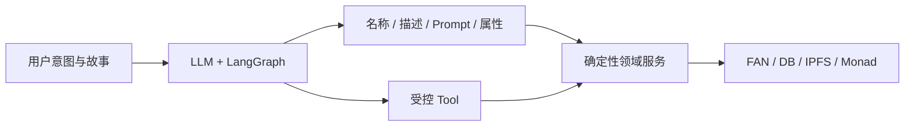
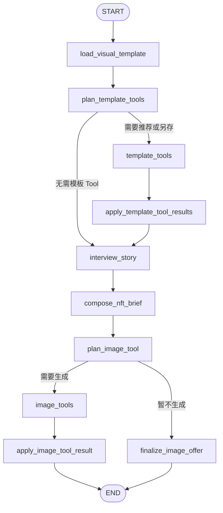
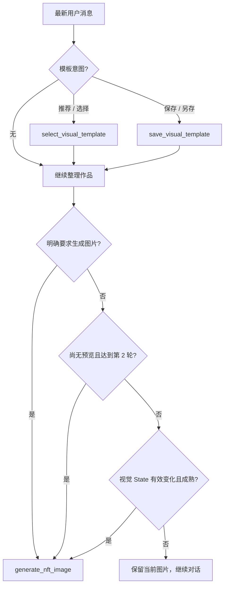
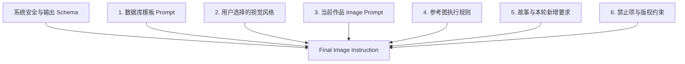
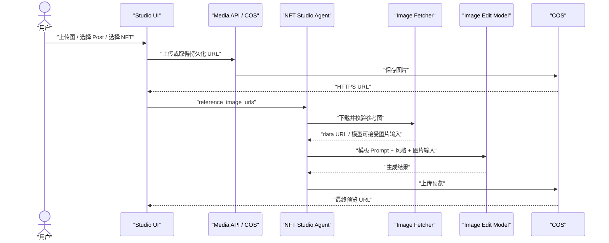
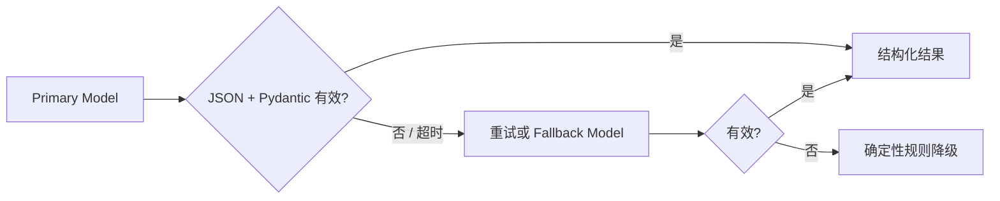
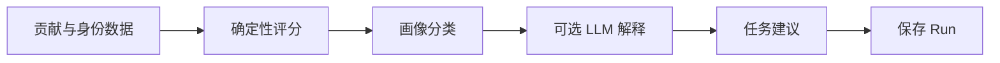
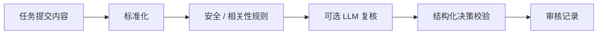

# Fanora AI Agent 设计

## 1. 设计定位

Fanora 的 Agent 不是一个自由执行资产操作的聊天机器人，而是“创作理解层”。它负责：

- 理解粉丝故事、性格、歌曲氛围、想象场景与情绪象征。
- 在多轮对话中维护同一件作品的 History 和 State。
- 优化 NFT 名称、作品描述、生图 Prompt 与公开属性。
- 推荐或保存数据库视觉模板。
- 判断何时调用图片生成 Tool，并使用参考图进行多模态创作。

以下操作必须由确定性服务完成：鉴权、FAN 增减、Forge 概率、随机判定、数据库事务、IPFS pin 和 Monad 交易。



## 2. Agent 清单

| Agent | 主要职责 | 是否可直接改资产 |
| --- | --- | --- |
| NFT Studio Agent | 多轮访谈、模板编排、作品草稿、图片调用 | 否 |
| NFT Creation Agent | 生成结构化名称、描述、Prompt、属性和图片请求 | 否 |
| Uploaded Image Analysis Agent | 多模态分析上传图，提取模板 / 风格线索 | 否 |
| Fan Profile Agent | 聚合贡献，计算画像并提供解释和任务建议 | 否 |
| Content Review Agent | 任务内容安全、相关性与质量判断 | 否 |
| Memory Forge Analysis | 五维结构化评分；失败时规则降级 | 否；结算由 Forge Service 完成 |

## 3. NFT Studio LangGraph

实际工作流位于 `backend/app/agents/nft_studio.py`：



### Node 职责

| Node | 输入 | 输出 |
| --- | --- | --- |
| `load_visual_template` | 用户、模板 ID、参考图 | 有权限访问的数据库模板与候选模板 |
| `plan_template_tools` | 最新消息、当前模板 | Tool Call 或继续访谈 |
| `template_tools` | Tool 参数、Runtime State | 模板选择 / 保存结果 |
| `apply_template_tool_results` | ToolMessage | 更新模板、参考图、已保存模板与 Trace |
| `interview_story` | History、故事、风格 | 助手回复、故事摘要、缺失字段与成熟度 |
| `compose_nft_brief` | 当前故事与视觉上下文 | 名称、描述、英文 Prompt、公开属性 |
| `plan_image_tool` | 草稿、视觉签名、用户意图 | 是否调用 `generate_nft_image` |
| `apply_image_tool_result` | 图片 Tool 结果 | COS URL、最后生成签名和降级信息 |
| `finalize_image_offer` | 不生图状态 | 返回继续创作或可生图提示 |

## 4. State 设计

`NftStudioState` 是整个多轮工作流的共享状态，不等同于数据库业务实体。

```text
NftStudioState
├── Conversation
│   ├── messages
│   ├── user_id
│   └── turn_count
├── Visual Context
│   ├── template_id / template / available_templates
│   ├── visual_style
│   ├── reference_image_urls
│   └── visual_signature
├── Story State
│   ├── story_summary
│   ├── missing_fields
│   └── ready_for_generation
├── Artifact Draft
│   ├── name
│   ├── description
│   ├── image_prompt
│   └── suggested_attributes
├── Generation Memory
│   ├── last_image_url
│   ├── last_generated_signature
│   ├── last_generated_template_id
│   ├── last_generated_style
│   └── last_generated_reference_urls
└── Tool State
    ├── explicit_image_request
    ├── should_generate_image
    ├── image_generated
    ├── saved_template
    └── tool_events
```

### 为什么需要 State

- LLM 单次请求没有长期记忆，State 让每轮都能继承用户认可的核心方向。
- `last_generated_*` 与 `visual_signature` 用于判断视觉是否真正改变，控制图片模型成本。
- State 只保存创作上下文；FAN、Forge 和 NFT 发布状态仍以 PostgreSQL 领域表为准。
- Checkpointer 优先使用 PostgreSQL；不可用时可用 `InMemorySaver` 本地降级。

## 5. Tool 设计

Tool 位于 `backend/app/agents/nft_visual_tools.py`。

### 5.1 `select_visual_template`

用途：当用户说“帮我推荐模板”“选一个适合的模板”等意图时，让 LLM 从当前可访问模板中推荐。

安全边界：

- Tool 只接受候选列表内的 `template_id`。
- 服务端再次按 `user_id` 查询权限。
- 模板不存在或无权访问时保留当前模板并返回降级结果。

### 5.2 `save_visual_template`

用途：用户说“另存为模板”“把当前版本保存成模板”等意图时，将当前作品方向保存为私有模板。

保存内容：

- 模板名称、分类与描述。
- 当前 `image_prompt`。
- 最后生成图片、用户参考图和原模板参考图，去重后最多 6 张。
- 调色板、元素与禁止项。

没有成功生成版本、Prompt 或参考图时，Tool 不创建空模板。

### 5.3 `generate_nft_image`

用途：在用户明确要求或工作流判断合适时生成新的 NFT 预览。

输入由 State 组装，不允许 LLM 自由提交任意用户或资产 ID：

- 数据库模板 Prompt。
- 用户选中的视觉风格 Prompt。
- 当前经过优化的作品 Prompt。
- 故事摘要、名称偏好和参考图说明。
- 参考图 URL，最多 6 张。
- 上一版本图片，可作为迭代图。

生成结果优先上传 COS；数据库和 State 保存 URL，而不是 Base64。

## 6. Tool 触发规则



### 明确生图指令

包含“生成图片”“马上生成”“先出图”等直接命令时，即使故事仍不完整，也应基于当前 State 尝试生成。包含“不要生成”“先不生图”等否定表达时不生成。

### 自动首图

如果尚无任何预览，第二轮对话会自动尝试生成，降低用户重复下指令的成本。

### 视觉变化检测

没有明确指令时，只有以下内容发生有效变化并达到生成条件才调用图片模型：

- 数据库模板发生变化。
- 用户选择的视觉风格发生变化。
- 参考图集合发生变化。
- 当前图片 Prompt 或核心作品方向发生变化。

“把当前版本另存为模板”等不改变画面的操作，不应触发重复生图。

## 7. Prompt 架构与优先级

Prompt 常量集中在 `backend/app/agents/nft_visual_templates.py`，模板数据本身来自数据库。



优先级原则：

1. 系统安全规则和输出 Schema 不可被模板覆盖。
2. 模板 Prompt 是画面结构与视觉语言的第一创作约束。
3. 用户明确选择的视觉风格必须进入最终请求。
4. 当前草稿负责本轮细节精修，不应把模板改写成无关主题。
5. 参考图是多模态视觉事实，要求保留主体族群、重复图案、构图密度、线条语言与配色关系。
6. 不生成 Logo、水印、可读文字、完整歌词、未经授权的真实艺人肖像或受保护角色。

## 8. 多模态参考图流程



如果图片 URL 无法访问、格式不支持或下载超时，必须在 Tool Trace 中返回降级原因，不能静默改成纯文本生图并声称已使用参考图。

## 9. 结构化输出与模型降级

LLM Service 使用 Pydantic Schema 校验结构化结果，并配置重试、Fallback Model 与总超时。



- 创作草稿降级时保留用户输入，不编造链上或资产结果。
- Forge 五维分析兼容模型偶尔返回的嵌套 `scores` 结构，并在校验失败时使用规则评分。
- 模型日志记录请求目标、模型、状态、Trace ID 和耗时；Authorization 与图片 Base64 必须脱敏。

## 10. Agent 与 Forge 的边界

```text
Agent 可以：
  理解故事、提出问题、推荐模板、优化作品、请求生成图片、给出评分建议

Agent 不可以：
  直接扣 FAN、直接发 Fragment、控制随机 roll、伪造 Forge 成功、写 IPFS、发送合约交易

Forge Service 可以：
  校验 Session、计算概率、结算 FAN/Credit、生成安全随机数、记录 Attempt、发 Fragment

NFT Service 可以：
  校验 Forge SUCCESS、固定 IPFS、创建 ERC-1155 类型、Mint、记录交易和处理购买失败
```

这条边界让模型输出即使不稳定，也不会直接破坏余额、权限或链上资产。

## 11. Fan Profile 与内容审核

### Fan Profile Agent



它解释成长与推荐任务，但不直接发放 FAN 或写合约。

### Content Review Agent



最终任务奖励由任务服务根据审核结果与幂等规则发放。

## 12. 可观测性与测试重点

应重点观测：

- 每个 Node 的开始、结束、耗时与 `conversation_id`。
- Tool 名称、状态和摘要，不记录敏感 Prompt 附件正文。
- LLM / Image Model 的模型名、请求 URL、HTTP 状态、Trace ID 与耗时。
- 参考图数量、格式和是否真正进入模型请求。
- 图片生成、COS 上传和结构化校验的独立失败率。

应重点测试：

- 模板推荐越权与不存在模板。
- 保存模板但语义未变时不生图。
- 用户连续明确要求生图时能够再次生成。
- 第二轮无首图时自动生成。
- 模板、风格、参考图的 Prompt 优先级。
- LLM 返回嵌套 / 非法 JSON 时的 Schema 兼容与降级。
- Tool 失败后 State 不丢失，下一轮可恢复。

## 13. 扩展 Tool 建议

在不突破资产边界的前提下，可继续增加：

- `search_fan_memory`：检索用户授权的历史 Post 与收藏。
- `review_visual_rights_risk`：提示素材和肖像风险，不作法律确权结论。
- `compare_image_versions`：比较构图、主体、风格与参考图一致度。
- `recommend_merch_format`：在票根、徽章、收藏卡、包装、手办等形态中推荐。
- `prepare_social_copy`：基于已发布作品生成社区分享文案。

新增 Tool 必须遵循：最小输入、服务端权限复核、结构化结果、幂等副作用和可见 Tool Trace。
