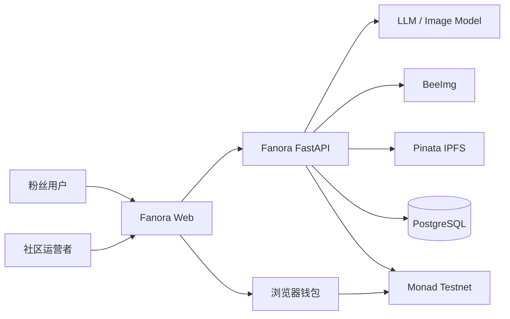
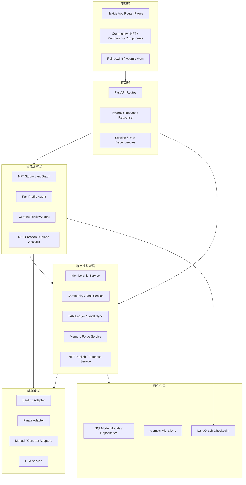
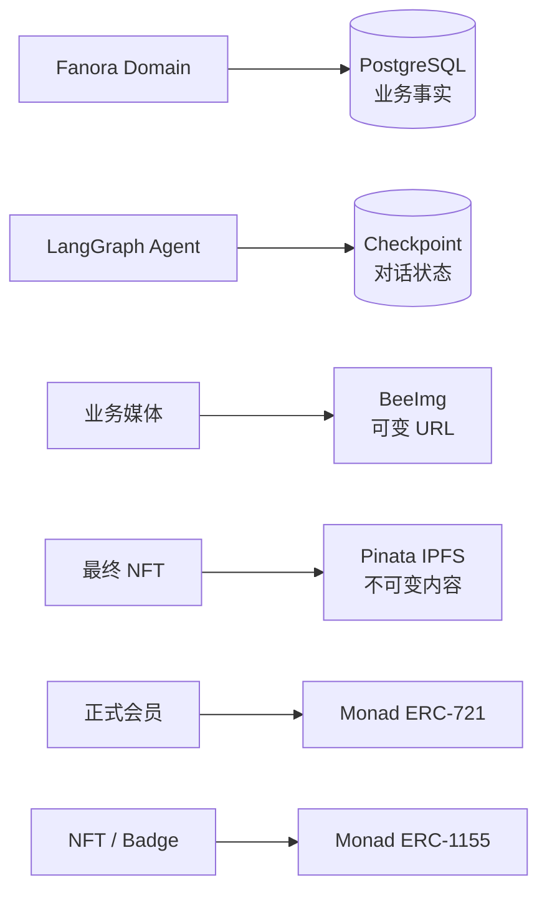
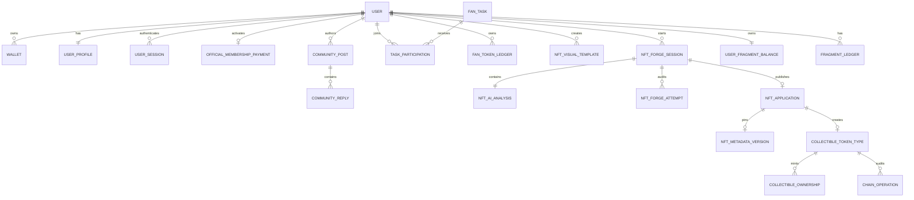
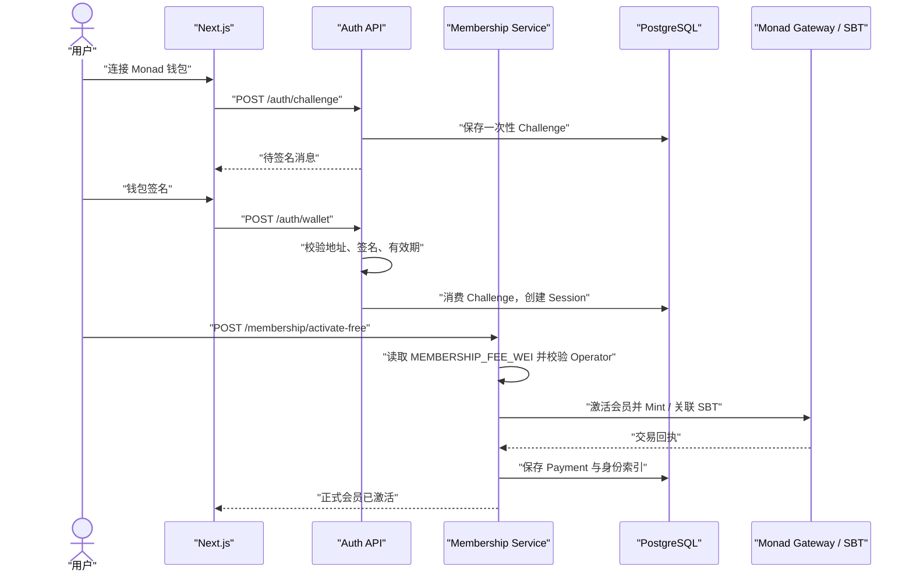
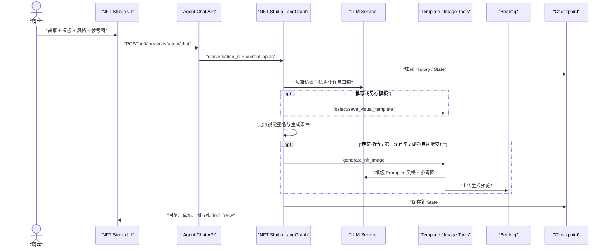
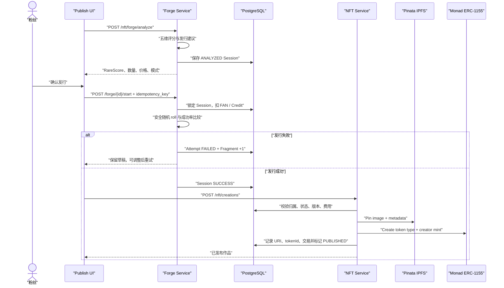
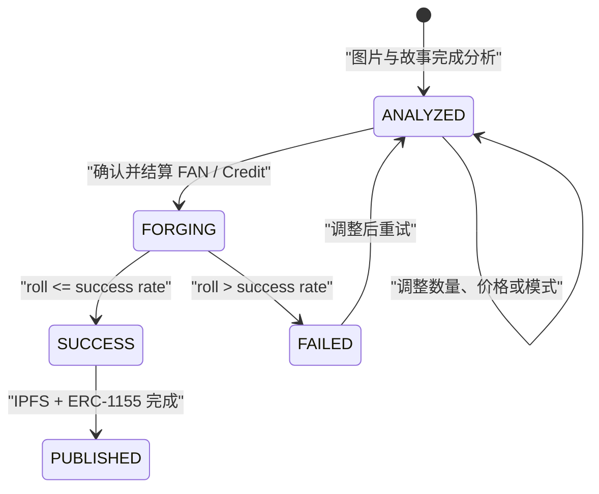
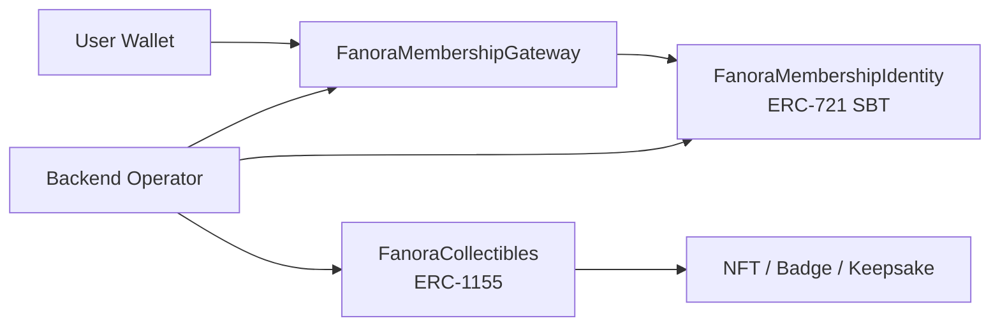

# Fanora 系统架构

## 1. 架构目标

Fanora 的架构围绕四个目标设计：

1. **AI 可演进，资产操作确定**：Agent 负责理解和创作，领域服务负责权限、余额、概率和链上写入。
2. **链上与站内职责清楚**：高频社区与 FAN 数据留在 PostgreSQL，最终身份与收藏品进入 Monad。
3. **媒体按生命周期分层**：业务图片使用 BeeImg URL，最终 NFT 图片与 metadata 固定到 IPFS。
4. **失败可恢复、操作可审计**：事务、幂等键、状态机、链上操作记录和结构化日志共同保护关键流程。

## 2. 系统上下文



浏览器负责用户签名与交互；服务端负责会话、业务事实、模型编排和 Operator 链上交易。服务端密钥不会下发到浏览器。

## 3. 分层架构



### 分层约束

- Route 只处理 HTTP、鉴权、Schema 和错误映射，不承载资产规则。
- Agent Node 可以读取 State、调用 LLM 和受控 Tool，但不能直接修改 FAN 或发送合约交易。
- Domain Service 管理事务、幂等、状态转换和权限。
- Adapter 隔离 BeeImg、Pinata、Monad、LLM 等供应商协议。
- SQLModel 与 Alembic 定义可迁移的数据事实。

## 4. 核心组件

| 组件 | 职责 |
| --- | --- |
| Next.js Web | 登录、社区、任务、Gallery、Collection、NFT Studio 与 Forge UI |
| Auth / Membership | 钱包挑战、签名验证、服务端会话、会员激活与链上身份同步 |
| Community / Tasks | Post、回复、互动、任务领取、内容审核、签到与奖励 |
| FAN Service | 可用余额、终身累计、幂等流水、排行榜和等级刷新 |
| NFT Studio Agent | 多轮故事状态、模板 Tool、Prompt 优化与条件式生图 |
| Memory Forge | 五维分析、策略建议、成功率、FAN / Credit 结算和 Fragment |
| NFT Service | 发布校验、IPFS pin、ERC-1155 创建 / Mint、购买与退款编排 |
| Media Adapters | BeeImg 业务图片与 Pinata 链上永久内容 |
| Contract Adapters | Gateway、Membership Identity 和 Collectibles 的读写封装 |

## 5. 数据与事实源



| 数据 | 主事实源 | 说明 |
| --- | --- | --- |
| 用户、钱包、会话、角色 | PostgreSQL | 服务端身份与权限依据 |
| 社区、Post、回复、任务、签到 | PostgreSQL | 高频业务状态 |
| FAN 余额、终身累计、流水 | PostgreSQL | 所有增减必须有幂等流水 |
| Agent History 与创作 State | PostgreSQL Checkpoint | 初始化失败时可退回内存，仅适合本地降级 |
| 模板、参考图、AI 预览 | PostgreSQL + BeeImg | 数据库保存结构和 URL，图片正文在 BeeImg |
| Forge Session、Analysis、Attempt、Fragment | PostgreSQL | 发行策略与审计事实 |
| 最终 NFT image / metadata | Pinata IPFS | 发布成功后固定 |
| 会员身份 | Monad ERC-721 | 不可转让 SBT |
| NFT、Badge、持有关系 | Monad ERC-1155 | PostgreSQL 保存展示索引和业务记录 |

## 6. 核心数据模型



`NftApplication` 仍保留业务字段和展示索引；链上 token 与 IPFS URI 通过 Metadata、Token Type 和 Chain Operation 关联。

## 7. 关键时序

### 7.1 钱包登录与会员激活



会员费使用本地环境配置作为接口判断依据，避免每次激活前读取链上 fee 导致 RPC 不稳定放大请求耗时。

### 7.2 AI NFT 共创



### 7.3 Forge 与正式发布



Forge 的随机判定不进入智能合约；只有 `SUCCESS` 的 Session 才能进入 IPFS 与 Monad 发布链路。

## 8. Forge 状态机



当前业务结果只有 `SUCCESS` 与 `FAILED`；兼容字段 `perfect_rate` 固定为 `0`。

## 9. 合约架构



| 合约 | Monad Testnet 地址 | 主要能力 |
| --- | --- | --- |
| `FanoraMembershipGateway` | `0x5e03167C671c40e40435769E2A5a0ba0D1c22b9F` | 会费、激活、paymentId 防重放 |
| `FanoraMembershipIdentity` | `0xeE3c3F36fF43aCB44F0F8271fbE7cdbAAcaF5c85` | 不可转让身份、等级和 URI 更新 |
| `FanoraCollectibles` | `0xB2ffc47D5a9407f0118e12749847821530533A84` | 类型创建、供应控制、Mint 和 URI |

生产环境应将 Admin、Treasury、Minter、URI Manager 和 Pauser 拆分为最小权限账户或多签。

## 10. 一致性与幂等

- `fan_token_ledger.idempotency_key` 防止重复奖励或扣费。
- `fragment_ledger.idempotency_key` 防止重复 Fragment 与兑换。
- Task Participation 对 `task_id + user_id` 唯一。
- Forge Session 与 Attempt 保存状态、费用、概率、roll、seed hash / reveal 和规则版本。
- `NftApplication.forge_session_id` 唯一，阻止同一成功结果重复发布。
- Chain Operation 保存外部链上动作，便于确认、重试与故障审计。
- 先验证本地状态，再调用外部系统；外部失败时不伪造成功业务状态。

## 11. 故障边界与降级

| 故障 | 行为边界 |
| --- | --- |
| LLM 超时或结构校验失败 | 使用规则草稿 / 评分降级；不允许 LLM 绕过资产规则 |
| Image Model 失败 | 保留对话与草稿，返回失败原因，允许下一轮重试 |
| BeeImg 失败 | 不把 Base64 写入数据库；预览可在供应商 URL 可用时临时展示 |
| Pinata 失败 | 停止正式发布，不发送 ERC-1155 创建 / Mint |
| Monad RPC / 交易失败 | 不标记链上操作成功；购买链路执行对应退款 / 恢复处理 |
| Redis / Langfuse 不可用 | 缓存或观测降级，核心 PostgreSQL 业务继续运行 |
| Checkpoint 初始化失败 | 本地可退到内存；生产需修复 PostgreSQL Checkpoint 以保证跨进程会话 |

## 12. 安全与可观测性

- Challenge 一次性消费，服务端会话控制受保护 API。
- 角色依赖保护管理接口；Operator 私钥只存在后端环境变量。
- BeeImg Token、Pinata JWT、LLM Key 不进入 `NEXT_PUBLIC_*`。
- 请求使用关联 ID，结构化日志记录阶段、状态和耗时。
- 图片模型日志可记录模型、URL、HTTP 状态和耗时，但隐藏 Authorization 与 Base64 正文。
- Prometheus 提供接口指标；Langfuse 为可选 LLM 观测能力。
- SlowAPI 提供接口限流，Pydantic / SQLModel 提供输入和持久化约束。

## 13. 目录结构

```text
Fanora/
├── frontend/
│   ├── app/                    # Next.js 页面与路由
│   ├── components/             # 社区、会员、NFT 与通用组件
│   └── lib/                    # API、钱包与 UI 工具
├── backend/
│   ├── app/api/routes/         # FastAPI 接口
│   ├── app/agents/             # LangGraph、Prompt 与 Tool
│   ├── app/services/           # 领域规则与外部操作编排
│   ├── app/adapters/           # BeeImg、Pinata、Monad 等适配器
│   ├── app/models/             # SQLModel 数据模型
│   ├── app/schemas/            # Pydantic 输入输出
│   └── alembic/                # 数据库迁移
├── contracts/                  # Solidity、Hardhat 与部署脚本
├── shared/contracts/           # ABI 与部署清单
└── docs/produce/               # 产品与技术文档
```

## 14. 扩展方向

- 将图片生成和链上发布迁移到队列 Worker，减少长请求占用。
- 增加模板审核、版权风险提示和社区运营工作台。
- 将 Forge 规则版本化并提供公开验证页面。
- 为多社区隔离模板、任务、FAN 规则和 Operator 权限。
- 增加二级市场或开放协议接口，但保持身份、积分与资产事实源边界不变。
