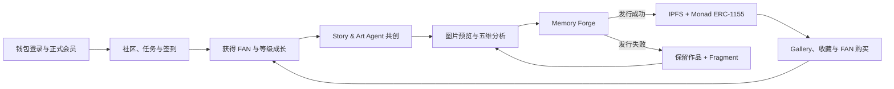
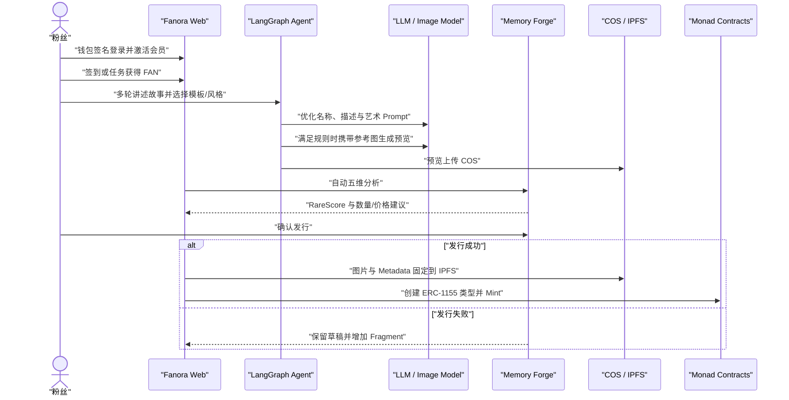
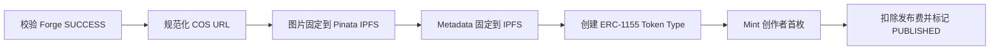
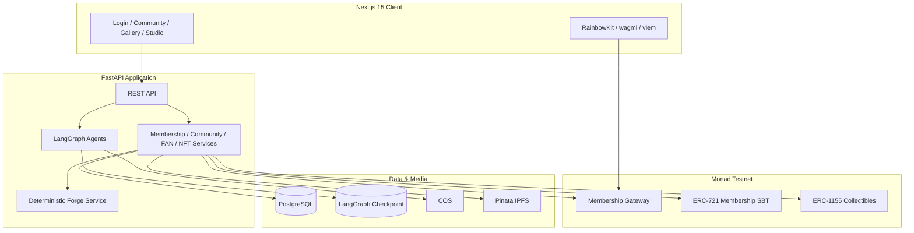

# Fanora 项目总览

> AI Agent 驱动的 Web3 粉丝身份、社区贡献与记忆 NFT 共创协议  
> Network: Monad Testnet · Hackathon MVP: 2026-08

## 1. 一句话介绍

Fanora 让粉丝通过真实社区参与获得 FAN 与链上身份，再由 AI Agent 将故事持续整理成可收藏的 NFT 或粉丝周边；发布时由 Memory Forge 给出发行策略并完成可审计判定，成功作品最终固定到 IPFS 并在 Monad 铸造。

**核心思想：贡献产生身份，故事形成作品，策略管理发行风险，链上证明最终归属。**

## 2. 问题与方案

| 行业问题 | Fanora 的方案 |
| --- | --- |
| 粉丝贡献分散，无法形成长期身份 | 将签到、任务和互动沉淀为 FAN 流水与终身成长等级 |
| AI 生图缺少真实故事与连续性 | LangGraph 保存 History 与 State，通过多轮对话持续精修同一件作品 |
| 参考图和视觉风格容易失控 | 数据库模板 Prompt、用户风格和多模态参考图共同约束生成 |
| NFT 发行缺少策略和参与感 | 五维分析自动建议供应量、价格与 Forge 模式 |
| 随机失败可能损害资产 | Forge 只决定是否进入发行；失败保留作品并发放 Memory Fragment |
| NFT 发行后缺少社区循环 | Gallery 提供点赞、收藏、FAN 购买与创作者回流 |

## 3. 产品闭环



## 4. Hackathon MVP 演示路径



评委在 3 分钟内可以观察到：身份激活、贡献成长、Agent 多轮共创、参考图生图、五维分析、Forge 判定以及链上收藏闭环。

## 5. 核心功能

### 5.1 身份与会员

- RainbowKit + wagmi + viem 钱包连接。
- Challenge / Signature 登录与服务端会话。
- Monad Gateway 正式会员激活和支付验证。
- ERC-721 不可转让会员身份，等级与 metadata 可更新。
- 动态会员卡同步到个人主页与 Collection。

### 5.2 社区、任务与 FAN

- 社区帖子、回复、二级回复、点赞与收藏。
- 每日签到、任务领取、素材提交、内容校验和奖励审计。
- `fan_token_balance` 表示可消费余额；`fan_token_lifetime_earned` 表示终身成长值。
- FAN 消费不降低会员等级，等级变化会触发会员卡刷新。
- 排行榜、公开粉丝画像与个人收藏页。

### 5.3 AI NFT Studio

- `/collections/create` 提供视觉模板、Agent 对话和作品预览。
- 模板保存在数据库，可由上传图片、社区 Post 或已有 NFT 创建。
- 每轮对话持续优化短名称、作品描述、英文生图 Prompt 和公开属性。
- `select_visual_template`、`save_visual_template`、`generate_nft_image` 三类 Tool。
- 明确生图指令会强制调用图片工具；没有首张预览时，第二轮自动尝试生成。
- 其余情况只有模板、风格、参考图或 Prompt 发生有效变化且状态成熟时才生图。

### 5.4 Memory Forge

AI 五维分析计算 RareScore：

```text
RareScore = Originality × 25%
          + Visual Quality × 20%
          + Fan Emotion × 25%
          + Scarcity × 20%
          + Community Potential × 10%
```

| 模式 | FAN 成本 | 概率修正 |
| --- | ---: | ---: |
| Stable | 10 | +15 |
| Focused | 20 | 0 |
| Legendary | 40 | -15 |

```text
QualityFactor = 35 + RareScore × 0.45

SuccessRate = clamp(
  (QualityFactor + SupplyFit + PriceFit + LevelBonus + ModeModifier)
  × MarketExposureMultiplier,
  20,
  95
)
```

当前结果只有 **发行成功** 或 **发行失败**。失败不会销毁故事或预览，并增加 1 个 Memory Fragment；5 个 Fragment 可兑换一次 Stable credit，10 个可兑换一次 Focused credit。

### 5.5 NFT 发行与收藏

发行成功后才进入正式发布链路：



- Gallery 展示价格、供应量、作者、会员等级和公开属性。
- 支持点赞、收藏和 FAN 购买。
- 购买会执行链上 Mint；失败时服务层处理 FAN 退款。
- Collection 聚合会员身份、Badge、ERC-1155 收藏品和创作作品。

## 6. 总体架构



关键原则：**LLM 负责理解、推荐与创作；确定性服务负责权限、FAN、概率、幂等、数据库和链上交易。**

## 7. 数据事实源

| 数据或行为 | 事实源 |
| --- | --- |
| 用户、会话、社区、任务、FAN、Forge | PostgreSQL |
| Agent 多轮对话状态 | LangGraph Checkpoint；不可用时进程内降级 |
| Post、回复、任务、模板、参考图、AI 预览 | COS URL |
| 最终 NFT 图片与 metadata | Pinata IPFS |
| 正式会员身份 | Monad ERC-721 SBT |
| NFT、Badge 与持有关系 | Monad ERC-1155；PostgreSQL 建立业务索引 |

## 8. Monad 合约

| 合约 | 地址 | 职责 |
| --- | --- | --- |
| `FanoraMembershipGateway` | `0x5e03167C671c40e40435769E2A5a0ba0D1c22b9F` | 会员激活、动态会费、支付防重放 |
| `FanoraMembershipIdentity` | `0xeE3c3F36fF43aCB44F0F8271fbE7cdbAAcaF5c85` | ERC-721 不可转让会员身份 |
| `FanoraCollectibles` | `0xB2ffc47D5a9407f0118e12749847821530533A84` | ERC-1155 NFT、Badge 与收藏品 |

网络：Monad Testnet，Chain ID `10143`。部署事实以 `shared/contracts/monadTestnet.deployment.json` 为准。

## 9. 技术栈

| 层 | 技术 |
| --- | --- |
| Web | Next.js 15、React 19、TypeScript、RainbowKit、wagmi、viem |
| API | FastAPI、Python 3.13、SQLModel、Pydantic、Alembic |
| Agent | LangGraph、LangChain Core、结构化 LLM 输出、多模态 Image Model |
| Storage | PostgreSQL、可选 Redis/Valkey、COS、Pinata IPFS |
| Chain | Solidity、Hardhat、web3.py、Monad Testnet |
| Operations | Structlog、Prometheus、可选 Langfuse、接口耗时指标 |

## 10. 当前 MVP 边界

已实现：

- 钱包登录、正式会员、链上身份与动态会员卡。
- 社区、任务、签到、FAN、等级、排行榜和粉丝画像。
- 数据库视觉模板、多轮 NFT Agent、Tool、参考图与多模态预览。
- 五维分析、发行建议、三种 Forge 模式、Fragment 与幂等结算。
- COS、Pinata IPFS、Monad ERC-1155 发布链路。
- Gallery、点赞、收藏、FAN 购买和 Collection。

不属于本次 MVP：多社区运营后台、二级市场、跨链资产、去中心化治理、版权确权服务和法币支付。

## 11. 本地运行

```bash
# Backend
cd backend
cp .env.example .env
make install
make migrate
make dev
```

```bash
# Frontend
cd frontend
cp .env.example .env.local
npm install
npm run dev
```

- Web: `http://localhost:3000`
- API Docs: `http://localhost:8000/docs`
- Health: `http://localhost:8000/api/v1/health`

服务端至少需要配置数据库、LLM、COS、Pinata、Monad RPC、运营钱包和合约地址；前端只配置 `NEXT_PUBLIC_*` 公共变量，禁止放入私钥或服务端 Token。

## 12. 继续阅读

- [功能树](FUNCTION_TREE.md)
- [系统架构](ARCHITECTURE.md)
- [AI Agent 设计](AI_AGENT_DESIGN.md)
- [系统需求](SYSTEM_REQUIREMENTS.md)
- [仓库首页](../../README.md)

Fanora 不是把粉丝故事简单变成一张 AI 图片，而是把贡献、身份、创作、策略、收藏与链上证明连接成一个可持续运转的粉丝经济闭环。
