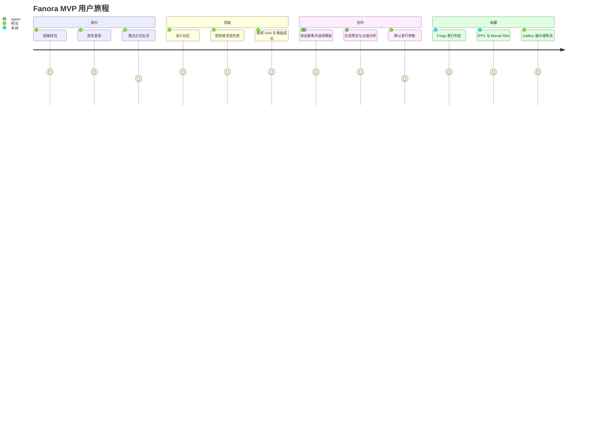
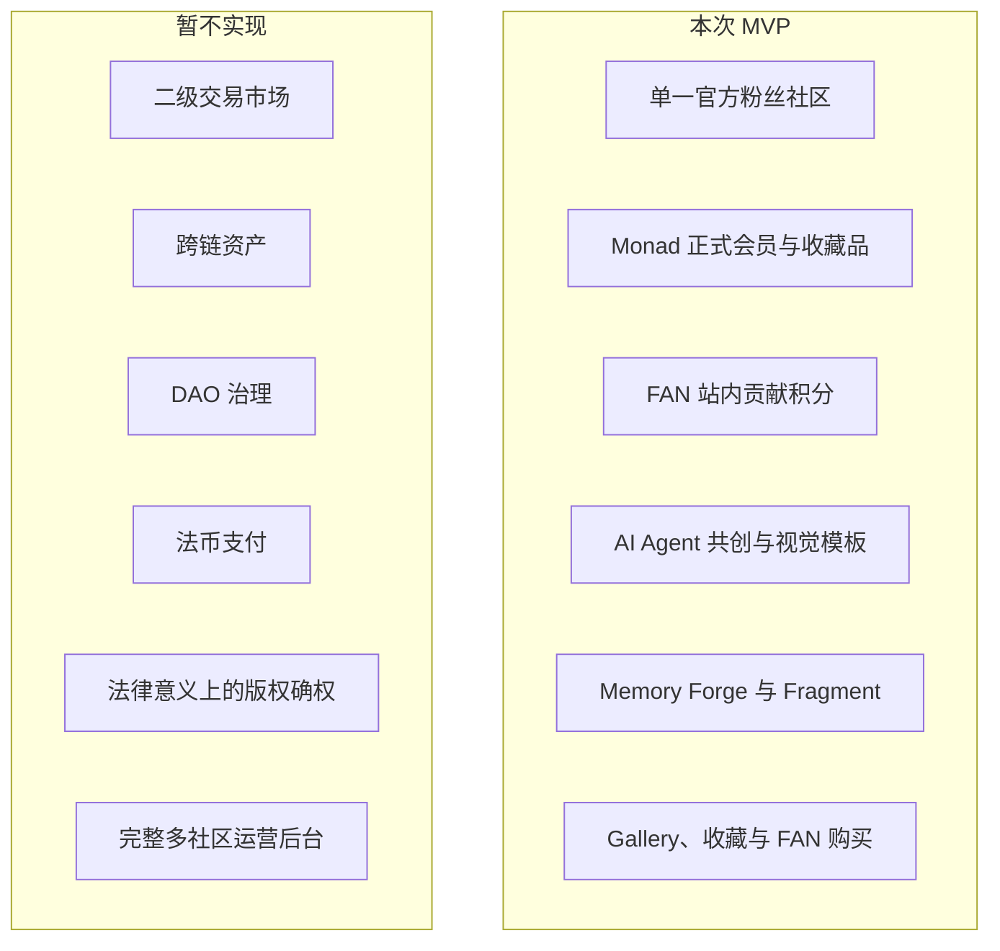

# Fanora 系统功能需求

## 1. 文档目标

本文定义 Fanora Hackathon MVP 的系统需求、验收标准和范围边界。优先级采用：

- **P0**：演示闭环必须具备。
- **P1**：形成完整产品体验的重要能力。
- **P2**：可增强，但不阻塞 MVP。

## 2. 参与者

| 参与者 | 目标 |
| --- | --- |
| 访客 | 理解产品、浏览社区与 NFT、进入钱包登录 |
| 粉丝用户 | 建立会员身份、贡献内容、获得 FAN、创作和收藏 NFT |
| 社区运营者 | 发布任务、配置奖励、维护社区内容 |
| 平台管理员 | 管理权限、资金、合约 Operator 和异常审计 |
| AI Agent | 理解故事、维护创作状态、推荐模板并调用受控 Tool |
| 区块链 / 外部服务 | 提供 Monad、COS、Pinata 与模型能力 |

## 3. MVP 用户旅程

## 4. 功能需求

### 4.1 身份认证

| ID | 优先级 | 需求 | 验收标准 |
| --- | --- | --- | --- |
| AUTH-001 | P0 | 系统应支持 EVM 钱包连接 | 用户可连接钱包并看到当前地址与网络 |
| AUTH-002 | P0 | 后端应签发一次性 Challenge | Challenge 有有效期且不可重复使用 |
| AUTH-003 | P0 | 系统应验证钱包签名并创建服务端会话 | 非法、过期或地址不匹配签名被拒绝 |
| AUTH-004 | P1 | 用户应能退出登录 | 当前会话失效，受保护接口不再可访问 |
| AUTH-005 | P0 | 前端应引导用户连接 Monad Testnet `10143` | 网络不匹配时给出切换入口，不继续链上操作 |

### 4.2 正式会员与链上身份

| ID | 优先级 | 需求 | 验收标准 |
| --- | --- | --- | --- |
| MEM-001 | P0 | 系统应查询当前正式会员状态 | 返回激活、支付、钱包和链上身份状态 |
| MEM-002 | P0 | 当本地 `MEMBERSHIP_FEE_WEI=0` 时支持免费激活 | 后端 Operator 完成链上激活并记录 payment |
| MEM-003 | P0 | 非零会费应通过链上交易验证激活 | 交易链、合约、付款人、金额和重复支付均被校验 |
| MEM-004 | P0 | 正式会员身份应对应不可转让 ERC-721 SBT | 用户可同步 tokenId 与 metadata URI |
| MEM-005 | P1 | 等级变化应刷新会员卡 | 卡片 metadata 与最新等级一致，失败可重试 |
| MEM-006 | P1 | 未激活用户进入受限 Collection 流程时应被引导到 `/membership/join` | 用户不会进入无法完成的受限操作 |

### 4.3 社区内容

| ID | 优先级 | 需求 | 验收标准 |
| --- | --- | --- | --- |
| COMM-001 | P0 | 用户可浏览并加入官方社区 | 加入状态持久化且重复调用幂等 |
| COMM-002 | P0 | 正式会员可发布带图片的 Post | 图片上传 COS，数据库只保存 URL |
| COMM-003 | P0 | 用户可回复及创建二级回复 | 回复关系、计数和作者信息正确 |
| COMM-004 | P1 | Post 与回复支持点赞，Post 支持收藏 | 同一用户状态可切换且计数一致 |
| COMM-005 | P1 | 社区图片应支持历史 Base64 数据迁移 | 迁移后 URL 可展示，失败记录可追踪 |

### 4.4 任务、签到与 FAN

| ID | 优先级 | 需求 | 验收标准 |
| --- | --- | --- | --- |
| TASK-001 | P0 | 运营者可创建并发布带奖励规则的任务 | 时间、人数、奖励和校验规则可配置 |
| TASK-002 | P0 | 用户可领取并提交任务 | 重复领取不会创建第二份参与记录 |
| TASK-003 | P0 | 系统应校验任务内容并记录审计 | 规则 / LLM 结果、理由和降级状态可查询 |
| TASK-004 | P0 | 完成任务后应幂等发放 FAN | 同一来源只产生一条有效奖励流水 |
| TASK-005 | P0 | 用户每日可签到一次 | 连续天数和 FAN 奖励正确，重复签到被拒绝 |
| FAN-001 | P0 | 系统应维护 FAN 可用余额与终身累计 | 支出减少余额但不减少 lifetime earned |
| FAN-002 | P1 | 系统应提供 FAN 流水和排行榜 | 流水可说明来源，排行榜使用终身累计 |
| FAN-003 | P1 | 余额不足时应拒绝 Forge、发布或购买 | 不产生负数余额或部分完成状态 |

### 4.5 AI NFT Studio

| ID | 优先级 | 需求 | 验收标准 |
| --- | --- | --- | --- |
| AGENT-001 | P0 | Agent 应保存多轮 History 与 State | 同一 `conversation_id` 能继续上一轮作品 |
| AGENT-002 | P0 | 每轮应优化名称、描述、图片 Prompt 与公开属性 | 输出符合结构化 Schema，名称简短且描述忠于用户故事 |
| AGENT-003 | P0 | 模板应来自数据库，不使用本地默认模板作为事实源 | 用户只能加载有权限访问的模板 |
| AGENT-004 | P0 | 用户可从上传图、Post 或 NFT 建立视觉模板 | 模板保存 Prompt 和至少一张展示 / 参考图 |
| AGENT-005 | P0 | Agent 应支持模板推荐与另存 Tool | Tool 事件在响应中可见，权限由服务端验证 |
| AGENT-006 | P0 | 明确“生成图片”指令应触发生图 | 即使故事不完整，也应基于现有 State 尝试生成预览 |
| AGENT-007 | P0 | 无首图时第二轮应自动尝试生成预览 | 用户无需重复点击独立生图按钮 |
| AGENT-008 | P1 | 非明确指令只在视觉状态有效变化时生图 | 仅保存模板或语义未变时不重复调用图片模型 |
| AGENT-009 | P0 | 生图应按模板 Prompt、选中风格和参考图执行 | 请求携带可访问的多模态图片，模板优先级高于泛化 Prompt |
| AGENT-010 | P1 | 图片模型失败应返回可理解的降级结果 | 对话 State 保留，可继续重试，不丢失草稿 |

### 4.6 Memory Forge

| ID | 优先级 | 需求 | 验收标准 |
| --- | --- | --- | --- |
| FORGE-001 | P0 | 图片生成后应进行五维分析 | 返回五项 0-100 分、RareScore 和改进建议 |
| FORGE-002 | P0 | 系统应自动建议发行数量、价格和 Forge 模式 | 建议值回填到发布表单，用户可调整 |
| FORGE-003 | P0 | 成功率应由评分、供给适配、价格适配、等级和模式计算 | 概率限制在配置的最小值和最大值之间 |
| FORGE-004 | P0 | Forge 只能返回发行成功或发行失败 | 当前业务不得展示 Perfect 结果 |
| FORGE-005 | P0 | 开始 Forge 时应原子结算 FAN 或 Credit | 幂等请求不重复扣费 |
| FORGE-006 | P0 | 发行失败应保留创作并增加 1 Fragment | 不调用 IPFS 和合约，不删除图片或故事 |
| FORGE-007 | P1 | Fragment 应支持 5 换 Stable、10 换 Focused | 余额和 Credit 流水一致且不可重复兑换 |
| FORGE-008 | P1 | Forge 判定应可审计 | 保存规则版本、概率、roll、seed hash / reveal 和结果 |
| FORGE-009 | P1 | 系统应限制同一用户进行中 Session 和每日次数 | 默认每日最多 5 次，可由环境变量调整 |

### 4.7 NFT 发布、Gallery 与收藏

| ID | 优先级 | 需求 | 验收标准 |
| --- | --- | --- | --- |
| NFT-001 | P0 | 发布必须关联当前用户成功的 Forge Session | 非本人、非 SUCCESS、已发布或图片版本不一致均被拒绝 |
| NFT-002 | P0 | 发布应将最终图片与 metadata 固定到 Pinata IPFS | 数据库保存 CID / URI，链上 metadata 可访问 |
| NFT-003 | P0 | 发布应创建 ERC-1155 类型并 Mint 创作者首枚 | 供应上限、价格、tokenId 和交易记录一致 |
| NFT-004 | P0 | Gallery 应显示已发布作品 | 返回作者、价格、供应、互动和会员等级信息 |
| NFT-005 | P1 | 用户可点赞和收藏作品 | 同一用户的互动可切换且聚合计数正确 |
| NFT-006 | P0 | 用户可使用 FAN 购买可售作品 | 余额和剩余供应足够时 Mint 给买家 |
| NFT-007 | P0 | 购买链上失败时应恢复 FAN | 不保留未完成的所有权记录 |
| NFT-008 | P1 | Collection 应聚合身份、Badge、NFT 和创作 | 用户可查看自己的链上与业务资产 |

### 4.8 媒体与外部服务

| ID | 优先级 | 需求 | 验收标准 |
| --- | --- | --- | --- |
| MEDIA-001 | P0 | 持久化业务图片应上传 COS | Post、回复、任务、模板、参考图和预览只保存 URL |
| MEDIA-002 | P0 | COS 应使用服务端 `COS_SECRET_ID` | Token 不返回浏览器、不写入日志明文 |
| MEDIA-003 | P0 | 最终 NFT 使用 IPFS，不以 COS 作为链上永久 URI | Metadata 中图片指向 IPFS URI |
| MEDIA-004 | P1 | 远程图加载失败应提供错误信息与重试路径 | 数据库事务和 Agent State 不因单次上传失败而丢失 |

## 5. 非功能需求

| ID | 类别 | 要求 |
| --- | --- | --- |
| NFR-001 | 安全 | 私钥、COS Token、Pinata JWT 和 LLM Key 仅存在服务端环境变量 |
| NFR-002 | 安全 | 管理 API、Agent 内部 API 和链上 Operator 操作必须鉴权 |
| NFR-003 | 一致性 | FAN、Fragment、任务奖励和发布使用事务与幂等键 |
| NFR-004 | 可用性 | Redis、Langfuse 或 LLM 不可用时，核心确定性业务应降级而非越权 |
| NFR-005 | 可观测性 | 请求应包含 Request ID；关键外部调用记录状态与耗时，不记录密钥和 Base64 正文 |
| NFR-006 | 性能 | 普通数据库 API 不应等待不必要的链上查询；长耗时模型和 RPC 调用应明确显示处理中状态 |
| NFR-007 | 可维护性 | Prompt、Agent State、Node、Tool、领域服务和 Adapter 分层维护 |
| NFR-008 | 兼容性 | Web 支持现代桌面与移动浏览器，钱包链 ID 必须与 Monad Testnet 一致 |
| NFR-009 | 数据 | 数据库迁移通过 Alembic 管理，生产数据不得依赖本地内存状态 |
| NFR-010 | 审计 | 链上交易、FAN 流水、Forge Attempt 和任务状态变化可追踪 |

## 6. MVP 范围与非目标

## 7. MVP 完成判定

满足以下条件即可视为完整演示闭环：

1. 用户能在 Monad Testnet 登录并成为正式会员。
2. 用户能通过签到或任务获得 FAN，余额和终身成长正确变化。
3. 用户能与 Agent 多轮共创，选用数据库模板和参考图生成预览。
4. 系统能显示五维评分并自动填入发行数量与价格建议。
5. 用户确认后 Forge 返回发行成功或失败，结算与 Fragment 正确。
6. 成功作品能固定到 IPFS、在 Monad ERC-1155 Mint，并出现在 Gallery / Collection。
7. 核心资产操作具有鉴权、幂等、日志和失败恢复路径。
